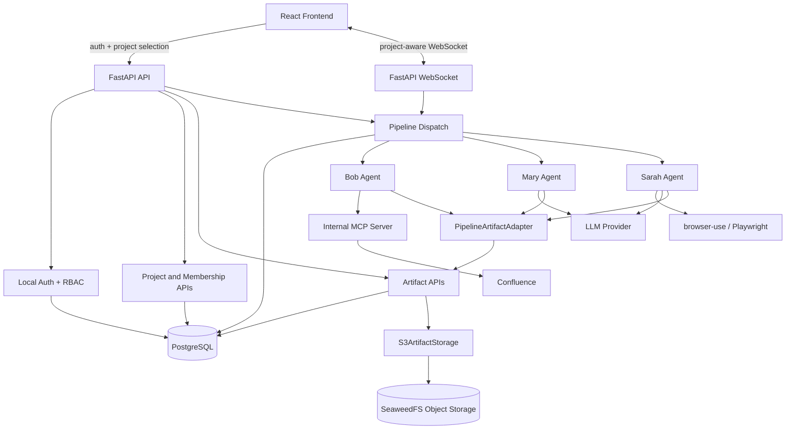

# AI QA Automation

AI QA Automation turns Jira and Confluence requirements into reviewed QA assets and Playwright automation scripts. It has a multi-user FastAPI backend, React frontend, PostgreSQL persistence, role-based administration, project-scoped artifacts, and project-aware agent pipelines.

## What the System Does

The application guides QA teams through an AI-assisted workflow:

1. **Bob** reads Confluence and Jira content and extracts requirements.
2. **Mary** turns approved requirements into structured test cases.
3. **Sarah** generates Playwright scripts from approved test cases.
4. **Jack** execute scripts and report results.

Each stage supports human review before outputs move forward. In project mode, generated requirements, test cases, scripts, reports, and metadata are persisted as versioned project artifacts.

## Architecture Snapshot



## Repository Layout

```text
.
├── src/ai_qa/
│   ├── agents/              # Bob, Mary, Sarah, BaseAgent lifecycle
│   ├── api/                 # FastAPI app, auth, admin, projects, artifacts, WebSocket
│   ├── artifacts/           # ArtifactService and LocalArtifactStorage
│   ├── auth/                # Local auth service and admin bootstrap
│   ├── db/                  # SQLAlchemy models, sessions, health helpers
│   ├── mcp/                 # Confluence/Jira-facing MCP client integration
│   └── pipelines/           # Pipeline context, run service, artifact adapter, stages
├── frontend/                # React + TypeScript + Vite application
├── alembic/                 # Database migrations
├── tests/                   # Backend tests
├── workspace/               # Runtime local artifacts and compatibility workspace
└── _bmad-output/            # Planning and implementation artifacts
```

## Core Concepts

### Users and Roles

Users are stored in PostgreSQL. Passwords are hashed with Argon2 through `pwdlib`.

Supported application roles:

- `admin` — can list users, create projects, assign memberships, and access any project-scoped resource.
- `standard` — can access only projects where they have a membership row.

Public registration creates active `standard` users only. Admin accounts are created or updated through the bootstrap command.

### Projects and Memberships

Projects are the collaboration boundary. A standard user sees only projects where they are a member. Admin users can list and inspect all projects.

Membership roles are currently:

- `member`
- `owner`

The backend revalidates the current user against the database for protected operations, so stale or tampered session claims are not trusted.

### Artifacts and Versions

Generated outputs are stored as project-scoped artifacts:

- requirements
- test cases
- Playwright/test scripts
- Markdown and Mermaid content
- screenshots and reports
- configuration or metadata outputs

`ArtifactService` writes metadata to PostgreSQL and delegates content bytes to `LocalArtifactStorage`. Every update appends an immutable `ArtifactVersion` row, updates the artifact's `current_version`, and records a content hash.

## API Overview

### Auth Routes

Auth routes are mounted outside `/api`:

| Method | Path | Purpose |
| --- | --- | --- |
| `POST` | `/auth/login` | Log in and set the signed session cookie |
| `POST` | `/auth/logout` | Clear the session |
| `GET` | `/auth/me` | Return the current database-revalidated user |
| `GET` | `/auth/status` | Lightweight auth status check |

> Public self-service registration is disabled. User accounts are created only by admins via `POST /api/admin/users`.

### Project and Admin Routes

Protected routes are mounted under `/api`:

| Method | Path | Purpose |
| --- | --- | --- |
| `GET` | `/api/projects` | List projects visible to the current user |
| `GET` | `/api/projects/{project_id}` | Get project details if admin/member authorized |
| `GET` | `/api/admin/users` | Admin-only user list |
| `POST` | `/api/admin/projects` | Admin-only project creation |
| `POST` | `/api/admin/projects/{project_id}/memberships` | Admin-only membership assignment/update |

### Artifact Routes

| Method | Path | Purpose |
| --- | --- | --- |
| `GET` | `/api/projects/{project_id}/artifacts` | List artifacts, optionally filtered by kind |
| `POST` | `/api/projects/{project_id}/artifacts` | Create an artifact and version 1 |
| `GET` | `/api/projects/{project_id}/artifacts/{artifact_id}` | Get artifact metadata and versions |
| `GET` | `/api/projects/{project_id}/artifacts/{artifact_id}/content` | Read current artifact content |
| `POST` | `/api/projects/{project_id}/artifacts/{artifact_id}/versions` | Append a new artifact version |

### Pipeline Routes

Project-aware pipeline actions include the selected project ID from the frontend and validate membership/admin access before dispatch.

Common routes include:

- `POST /api/start`
- `POST /api/approve`
- `POST /api/reject`
- `POST /api/skip`
- `POST /api/navigate`
- `WS /ws?project_id=<project-id>`

OpenAPI documentation is available at:

- `http://localhost:8000/docs`
- `http://localhost:8000/openapi.json`

## Local Development

### Prerequisites

- Python 3.14.6
- Node.js 26.3.0
- Docker (prefer Rancher Desktop 1.22.2)
- `uv` 0.11.20
- PostgreSQL 18.4 with pgAdmin 4 9.15

### Database & File Storage Setup

We recommend running PostgreSQL and SeaweedFS via Docker to avoid local environment conflicts. We have provided a `docker-compose.yml` for this purpose. Ensure Docker (or Rancher Desktop) is running, then execute:

```powershell
docker compose down -v
docker compose up -d
docker ps
```

This will spin up:

- PostgreSQL on port `5432`
- SeaweedFS (S3-compatible storage) on port `8333` (Master UI on `9333`)
- An initialization container that automatically creates the `ai-qa-artifacts` bucket.

### Backend Setup

```powershell
uv venv
.venv\Scripts\activate
uv sync
uv add --dev pytest
uv run playwright install

copy .env.example .env
```

Configure your `.env` file to connect to the local Docker database.
You MUST also generate a secure database encryption key for storing API credentials securely:

```powershell
uv run python -c "from cryptography.fernet import Fernet; print(Fernet.generate_key().decode())"
```

Copy the generated 32-byte base64 string and set it as `DB_ENCRYPTION_KEY` in your `.env` file.

### Bootstrap an Admin

Interactive password prompt (cd to repo root directory):

```powershell
uv run alembic upgrade head
uv run python -m ai_qa.auth.bootstrap_admin --email admin@example.com --name "Admin User"
```

### Frontend Setup

```powershell
Set-Location frontend
npm install
npm install -D @playwright/test
npx playwright install chromium --with-deps
```

The frontend API client defaults protected API calls to `/api`. To target a different protected API base path later, set `VITE_API_BASE_PATH`.

### Run Locally

PostgreSQL:

Start Docker or Rancher Desktop first. If this is your first local run, start the required services via Docker Compose:

```powershell
docker compose up -d
```

For later runs, if the containers are stopped, start them again:

```powershell
docker compose start
docker compose ps
```

Optional connection check:

```powershell
uv run python -c "from sqlalchemy import create_engine, text; from ai_qa.config import AppSettings; s=AppSettings(); e=create_engine(s.sqlalchemy_database_url, connect_args={'connect_timeout': 3}); c=e.connect(); print(c.execute(text('select 1')).scalar()); c.close()"
```

Then apply migrations before starting the backend:

```powershell
uv run alembic upgrade head
```

Backend:

```powershell
.venv\Scripts\activate
npx kill-port 8000
uv run uvicorn ai_qa.api:app --host 0.0.0.0 --port 8000 --reload
```

Frontend:

```powershell
Set-Location frontend
npm run dev
```

Frontend e2e test:

```powershell
Set-Location frontend
npx playwright test e2e
$env:PLAYWRIGHT_SLOW_MO='2000'; npx playwright test e2e --headed --workers=1
npx playwright test e2e/story-7-1-auth.spec.ts --headed --workers=1 --debug
```

`PLAYWRIGHT_SLOW_MO` is configured in `frontend/playwright.config.ts` and slows browser actions in milliseconds.

Backend tests:

```powershell
.venv\Scripts\activate
uv run pytest tests -k api --no-cov -q
uv run pytest
```

Default local URLs:

- Backend: `http://localhost:8000`
- API docs: `http://localhost:8000/docs`
- OpenAPI schema: `http://localhost:8000/openapi.json`
- Frontend: `http://localhost:5173`
- WebSocket: `ws://localhost:8000/ws`
- FileStorage UI: `http://localhost:8888/`
- FileStorage Infra: `http://localhost:9333/`

## Docker Build, Push, and UAT Deployment

The production deployment uses separate images, all grouped under the
`ai-qa-automation/` project path and tagged with plain SemVer (no leading `v`):

| Component | Image path |
| --- | --- |
| Backend | ai-qa-automation/backend:0.5.1 |
| Frontend | ai-qa-automation/frontend:0.5.1 |
| Database | ai-qa-automation/database:18.4 |
| Storage Server | ai-qa-automation/file-storage:4.33 |

### Build images locally

Need to input the newest version number from your local development environment in .env file e.g 0.5.1

```powershell
.\scripts\build-docker-images.ps1 -Version 0.5.1
```

Confirm image files exist

```powershell
docker images | findstr ai-qa
```

DB and SeaweedFS images (update only when version change)

```powershell
docker pull postgres:18.4-alpine
docker pull chrislusf/seaweedfs:4.33
# Tag and push to your private registry if necessary
docker login <docker-image-prefix>
docker tag postgres:18.4-alpine <docker-image-prefix>/ai-qa-automation/database:18.4
docker tag chrislusf/seaweedfs:4.33 <docker-image-prefix>/ai-qa-automation/file-storage:4.33
docker push <docker-image-prefix>/ai-qa-automation/database:18.4
docker push <docker-image-prefix>/ai-qa-automation/file-storage:4.33
```

### Push images to Artifactory

Automation login using ARTIFACTORY_USERNAME and ARTIFACTORY_PASSWORD in `.env` file:

```powershell
.\scripts\build-docker-images.ps1 -Version 0.5.1 -Login -Push
```

### Deploy on UAT web server

Connect to the UAT server:

```bash
ssh <user>@<server>
```

Optional environment checks:

```bash
free -h
df -h
git --version
docker --version
docker compose version
```

For Docker deployment, the server does not need the same Python or Node.js versions as local development. Python `3.14.6`, Node.js `26.3.0`, uv `0.11.20`, and Nginx `1.31.1` are already inside the Docker images. The UAT server mainly needs Docker Engine and Docker Compose.

Find the existing Compose file:

```bash
pwd
ls -la
find . -maxdepth 3 -iname 'docker-compose*.yml' -o -iname 'compose*.yml'
cd project-folder
```

Edit the Compose file and .env file with one of these commands:

```bash
nano .env
nano docker-compose.yml
```

Use the pushed images with the newest version e.g 0.4.0 and keep the services on the same Docker Compose network.

Pull and recreate the containers:

```bash
docker login <docker-image-prefix>
docker compose -f docker-compose.yml pull
docker compose -f docker-compose.yml up -d
docker compose -f docker-compose.yml ps
```

Run database migrations after the backend image is deployed:

```bash
docker compose -f docker-compose.yml exec backend alembic upgrade head
```

Create admin account (one time only)

```bash
docker compose -f docker-compose.yml exec backend python -m ai_qa.auth.bootstrap_admin --email <admin-email> --name <admin-name>
```

The frontend image serves the Vite build through Nginx and proxies `/api`, `/auth`, and `/ws` to the backend service named `ai-qa-backend` inside the Docker Compose network.

### Run E2E tests from the deployed server

The admin "Run E2E Tests" button triggers an in-process Playwright run inside the backend container. The backend image therefore bundles a Playwright runner (Node.js, Chromium, and the `frontend/e2e` specs) on top of the Python runtime — this makes the backend image noticeably larger than a pure API image.

To make the button work on the server, set these in the deployment `.env` (the compose file forwards them to the backend container):

- `E2E_SERVER_MODE=1` — runs headless (no display on a server), disables the Chromium sandbox (root in a container), and ignores TLS errors.
- `BASE_URL=https://<your-deployed-host>` — the browser drives the deployed app over HTTPS. It **must** be HTTPS, because the session cookie is `Secure` and a browser never sends a `Secure` cookie over plain HTTP.
- `API_URL=http://localhost:8000` — used by E2E global setup/teardown (server-to-server, Bearer token); the backend reaches itself in-container.
- `ADMIN_EMAIL` / `ADMIN_PASSWORD` — the admin account E2E uses to seed and clean up synthetic test data.

The compose example sets `shm_size: "1gb"` for the backend (Chromium needs more shared memory than the 64 MB default). If the backend container cannot resolve the public `BASE_URL` hostname, uncomment the `extra_hosts` mapping in `docker-compose-server.yml.example`.

> Local development is unchanged: the button runs headed with slow motion against the running uvicorn + Vite servers, reusing them instead of starting its own.

## Useful Manual Checks

```powershell
# Health
curl http://localhost:8000/api/health

# Auth status
curl http://localhost:8000/auth/status

# Current user
curl -b "aiqa_session=<your_session_cookie>" http://localhost:8000/auth/me

# Visible projects
curl -b "aiqa_session=<session_cookie>" http://localhost:8000/api/projects

# Admin users
curl -b "aiqa_session=<admin_session_cookie>" http://localhost:8000/api/admin/users

# Project artifacts
curl -b "aiqa_session=<session_cookie>" http://localhost:8000/api/projects/<project_id>/artifacts
```

## Testing and Quality

### Backend

```powershell
# Static checks
uv run ruff check .
uv run mypy src/

# Full backend suite with configured coverage gate
uv run pytest tests -q

# Full backend suite without coverage gate, useful during story validation
uv run pytest tests -q --no-cov
```

### Frontend

```powershell
Set-Location frontend
npm run typecheck
npm run test
```

## Security Notes

- Do not store session tokens in frontend local storage or logs.
- Do not trust frontend role, user, project, run, or artifact identifiers without database validation.
- Public registration cannot create admins.
- Admin and project-scoped APIs revalidate users from PostgreSQL.
- Standard users cannot access projects where they lack membership.
- API responses must not expose password hashes, tokens, raw storage paths, or ORM relationship graphs.
- Artifact storage sanitizes file names and blocks path traversal.
- Keep real credentials, API keys, and secret-like values out of documentation, tests, fixtures, and commits.

## Troubleshooting

```powershell
# Free common dev ports
npx kill-port 8000 5173

# Alternative Windows backend cleanup
Get-Process python -ErrorAction SilentlyContinue | Stop-Process -Force

# Recreate virtual environment if dependencies drift
Remove-Item -Recurse -Force .venv
uv venv
uv sync

# Reinstall Playwright browsers
uv run playwright install --force
```

If protected API calls unexpectedly return `401`, log in again and confirm the session cookie is being sent. If a standard user sees an empty project list, assign them to a project through an admin account before starting the pipeline.
