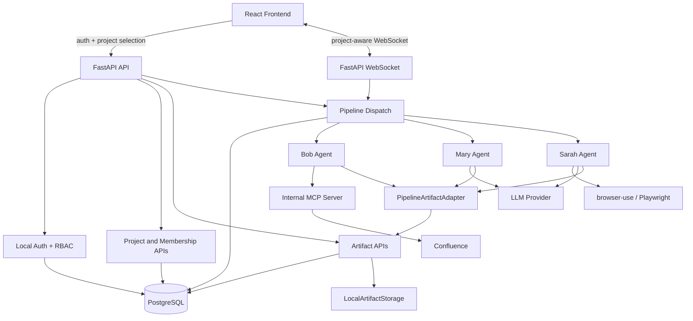

# AI QA Automation

AI QA Automation turns Jira and Confluence requirements into reviewed QA assets and Playwright automation scripts. After Epic 12, the project is no longer a single-user workspace prototype: it now has a multi-user FastAPI backend, React frontend, PostgreSQL persistence, local authentication, role-based administration, project-scoped artifacts, and project-aware agent pipelines.

## What the System Does

The application guides QA teams through an AI-assisted workflow:

1. **Bob** reads Confluence content and extracts requirements.
2. **Mary** turns approved requirements into structured test cases.
3. **Sarah** generates Playwright scripts from approved test cases.
4. **Jack** is planned next in Epic 6 to execute scripts and report results.

Each stage supports human review before outputs move forward. In project mode, generated requirements, test cases, scripts, reports, and metadata are persisted as versioned project artifacts instead of being written directly to global `workspace/*` folders.

## Current Project State

Epic 12 is complete.

| Area | Current state |
| --- | --- |
| Backend | FastAPI REST and WebSocket API with project-aware pipeline dispatch |
| Frontend | React + TypeScript + Vite UI with login, project selection, and admin basics |
| Database | PostgreSQL via SQLAlchemy 2.x and Alembic |
| Authentication | Local email/password auth with Argon2 password hashes and signed sessions |
| Authorization | Database-revalidated RBAC and project membership checks |
| Storage | Project-scoped artifact metadata in PostgreSQL and local content storage abstraction |
| Pipeline | Bob, Mary, and Sarah can run with project context and persist outputs through `ArtifactService` |
| Quality | Pytest, Vitest, Ruff, mypy, TypeScript, pre-commit |

## Architecture Snapshot



## Repository Layout

```text
.
├── src/ai_qa/
│   ├── agents/              # Bob, Mary, Sarah, BaseAgent lifecycle
│   ├── api/                 # FastAPI app, auth, admin, projects, artifacts, WebSocket
│   ├── artifacts/           # ArtifactService and LocalArtifactStorage
│   ├── auth/                # Local auth service and admin bootstrap
│   ├── db/                  # SQLAlchemy models, sessions, health helpers
│   ├── mcp/                 # Confluence/Jira-facing MCP client integration
│   └── pipelines/           # Pipeline context, run service, artifact adapter, stages
├── frontend/                # React + TypeScript + Vite application
├── alembic/                 # Database migrations
├── tests/                   # Backend tests
├── workspace/               # Runtime local artifacts and compatibility workspace
└── _bmad-output/            # Planning and implementation artifacts
```

## Core Concepts

### Users and Roles

Users are stored in PostgreSQL. Passwords are hashed with Argon2 through `pwdlib`.

Supported application roles:

- `admin` — can list users, create projects, assign memberships, and access any project-scoped resource.
- `standard` — can access only projects where they have a membership row.

Public registration creates active `standard` users only. Admin accounts are created or updated through the bootstrap command.

### Projects and Memberships

Projects are the collaboration boundary. A standard user sees only projects where they are a member. Admin users can list and inspect all projects.

Membership roles are currently:

- `member`
- `owner`

The backend revalidates the current user against the database for protected operations, so stale or tampered session claims are not trusted.

### Artifacts and Versions

Generated outputs are stored as project-scoped artifacts:

- requirements
- test cases
- Playwright/test scripts
- Markdown and Mermaid content
- screenshots and reports
- configuration or metadata outputs

`ArtifactService` writes metadata to PostgreSQL and delegates content bytes to `LocalArtifactStorage`. Every update appends an immutable `ArtifactVersion` row, updates the artifact's `current_version`, and records a content hash.

### Pipeline Runs

Project-mode pipeline execution records `PipelineRun` rows with project, user, status, timestamps, provider/model/config summary, and failure/summary details where available. Artifacts created during a run are linked back to the run.

Legacy workspace behavior is preserved only as a compatibility seam. New project-mode pipeline logic should use `PipelineContext`, `PipelineRunService`, and `PipelineArtifactAdapter`.

## API Overview

### Auth Routes

Auth routes are mounted outside `/api`:

| Method | Path | Purpose |
| --- | --- | --- |
| `POST` | `/auth/register` | Register a standard user |
| `POST` | `/auth/login` | Log in and set the signed session cookie |
| `POST` | `/auth/logout` | Clear the session |
| `GET` | `/auth/me` | Return the current database-revalidated user |
| `GET` | `/auth/status` | Lightweight auth status check |

### Project and Admin Routes

Protected routes are mounted under `/api`:

| Method | Path | Purpose |
| --- | --- | --- |
| `GET` | `/api/projects` | List projects visible to the current user |
| `GET` | `/api/projects/{project_id}` | Get project details if admin/member authorized |
| `GET` | `/api/admin/users` | Admin-only user list |
| `POST` | `/api/admin/projects` | Admin-only project creation |
| `POST` | `/api/admin/projects/{project_id}/memberships` | Admin-only membership assignment/update |

### Artifact Routes

| Method | Path | Purpose |
| --- | --- | --- |
| `GET` | `/api/projects/{project_id}/artifacts` | List artifacts, optionally filtered by kind |
| `POST` | `/api/projects/{project_id}/artifacts` | Create an artifact and version 1 |
| `GET` | `/api/projects/{project_id}/artifacts/{artifact_id}` | Get artifact metadata and versions |
| `GET` | `/api/projects/{project_id}/artifacts/{artifact_id}/content` | Read current artifact content |
| `POST` | `/api/projects/{project_id}/artifacts/{artifact_id}/versions` | Append a new artifact version |

### Pipeline Routes

Project-aware pipeline actions include the selected project ID from the frontend and validate membership/admin access before dispatch.

Common routes include:

- `POST /api/start`
- `POST /api/approve`
- `POST /api/reject`
- `POST /api/skip`
- `POST /api/navigate`
- `WS /ws?project_id=<project-id>`

OpenAPI documentation is available at:

- `http://localhost:8000/docs`
- `http://localhost:8000/openapi.json`

## Local Development

### Prerequisites

- Python 3.12+
- Node.js 20+
- PostgreSQL
- `uv`
- Playwright browser dependencies

### Backend Setup

```powershell
uv venv
.venv\Scripts\activate
uv sync
uv run playwright install

copy .env.example .env
uv run alembic upgrade head
```

Configure database and session settings in `.env`. You may use `DATABASE_URL` or the individual database settings supported by `src/ai_qa/config.py`.

Common settings:

```env
DATABASE_HOST=localhost
DATABASE_PORT=5432
DATABASE_NAME=ai_qa_automation
DATABASE_USER=<db-user>
DATABASE_PASSWORD=<db-password>
SESSION_EXPIRE_HOURS=8
SESSION_COOKIE_NAME=aiqa_session
```

### Bootstrap an Admin

Interactive password prompt:

```powershell
uv run alembic upgrade head
uv run python -m ai_qa.auth.bootstrap_admin --email admin@example.com --name "Admin User"
```

Automation-friendly environment variable flow:

```powershell
$env:AI_QA_BOOTSTRAP_ADMIN_PASSWORD = "<long-random-admin-password>"
uv run python -m ai_qa.auth.bootstrap_admin --email admin@example.com --name "Admin User"
Remove-Item Env:\AI_QA_BOOTSTRAP_ADMIN_PASSWORD
```

### Frontend Setup

```powershell
Set-Location frontend
npm install
```

The frontend API client defaults protected API calls to `/api`. To target a different protected API base path later, set `VITE_API_BASE_PATH`.

### Run Locally

Backend:

```powershell
npx kill-port 8000
uv run uvicorn ai_qa.api:app --host 0.0.0.0 --port 8000 --reload
```

Frontend:

```powershell
Set-Location frontend
npm run dev
```

Default local URLs:

- Backend: `http://localhost:8000`
- API docs: `http://localhost:8000/docs`
- OpenAPI schema: `http://localhost:8000/openapi.json`
- Frontend: `http://localhost:5173`
- WebSocket: `ws://localhost:8000/ws`

## Useful Manual Checks

```powershell
# Health
curl http://localhost:8000/api/health

# Auth status
curl http://localhost:8000/auth/status

# Current user
curl -b "aiqa_session=<your_session_cookie>" http://localhost:8000/auth/me

# Visible projects
curl -b "aiqa_session=<session_cookie>" http://localhost:8000/api/projects

# Admin users
curl -b "aiqa_session=<admin_session_cookie>" http://localhost:8000/api/admin/users

# Project artifacts
curl -b "aiqa_session=<session_cookie>" http://localhost:8000/api/projects/<project_id>/artifacts
```

## Testing and Quality

### Backend

```powershell
# Full backend suite with configured coverage gate
uv run pytest tests -q

# Full backend suite without coverage gate, useful during story validation
uv run pytest tests -q --no-cov

# Epic 12 focused regression examples
uv run pytest tests/test_auth_password.py tests/test_auth_service.py tests/test_auth_api.py tests/test_admin_rbac_api.py tests/test_project_api.py tests/test_artifact_api.py tests/test_artifact_service.py -q --no-cov
uv run pytest tests/test_pipeline_project_context.py tests/test_project_scoped_agents.py tests/test_pipeline_artifact_adapter.py tests/test_pipeline_websocket_project_context.py tests/test_api.py -q --no-cov

# Static checks
uv run ruff check .
uv run mypy src/
```

### Frontend

```powershell
Set-Location frontend
npm run typecheck
npm run test
```

Recent Epic 12 validation highlights:

- Story 12.5 backend full regression: `474 passed, 2 skipped` with `--no-cov`.
- Story 12.6 TypeScript validation passed; targeted frontend tests for auth/project/admin/API-client behavior passed.
- Story 12.7 project-context backend regression passed: `41 passed` across project pipeline, artifact adapter, project-scoped agents, WebSocket project context, and API tests.

Some older frontend component tests may still have pre-existing expectation drift unrelated to Epic 12's project/auth/admin foundation.

## Security Notes

- Do not store session tokens in frontend local storage or logs.
- Do not trust frontend role, user, project, run, or artifact identifiers without database validation.
- Public registration cannot create admins.
- Admin and project-scoped APIs revalidate users from PostgreSQL.
- Standard users cannot access projects where they lack membership.
- API responses must not expose password hashes, tokens, raw storage paths, or ORM relationship graphs.
- Artifact storage sanitizes file names and blocks path traversal.
- Keep real credentials, API keys, and secret-like values out of documentation, tests, fixtures, and commits.

## Troubleshooting

```powershell
# Free common dev ports
npx kill-port 8000 5173

# Alternative Windows backend cleanup
Get-Process python -ErrorAction SilentlyContinue | Stop-Process -Force

# Recreate virtual environment if dependencies drift
Remove-Item -Recurse -Force .venv
uv venv
uv sync

# Reinstall Playwright browsers
uv run playwright install --force
```

If protected API calls unexpectedly return `401`, log in again and confirm the session cookie is being sent. If a standard user sees an empty project list, assign them to a project through an admin account before starting the pipeline.

## Roadmap

Next planned work resumes at **Epic 6**:

- Story 6.1: Script runner pipeline stage
- Story 6.2: Execution report generation
- Story 6.3: Jack agent test execution and final report presentation

Deferred work includes Azure Entra SSO in Epic 11 and broader audit/metrics/reporting epics later in the backlog.
