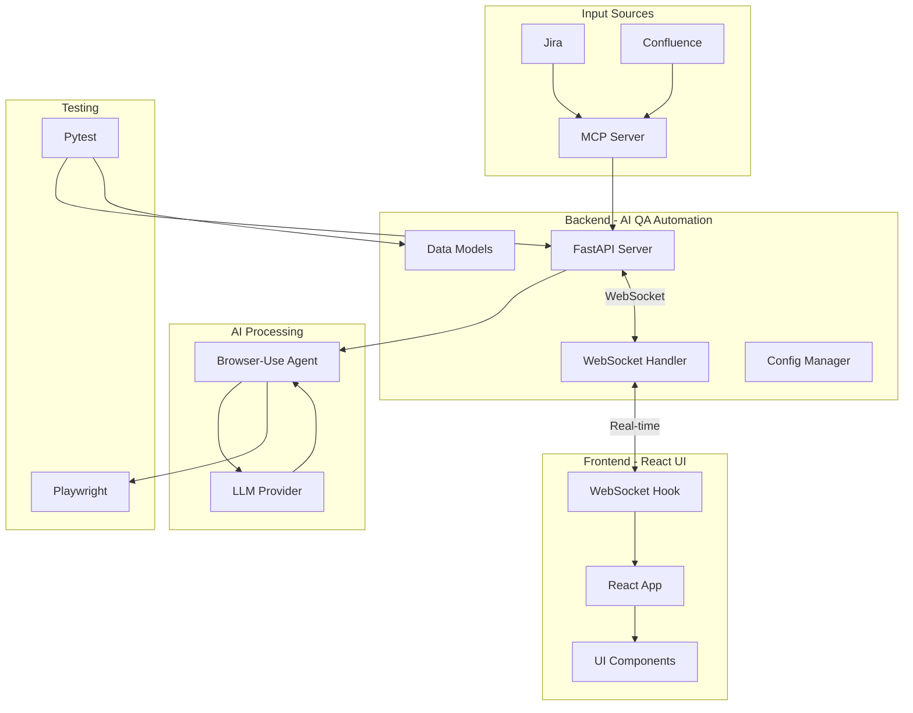
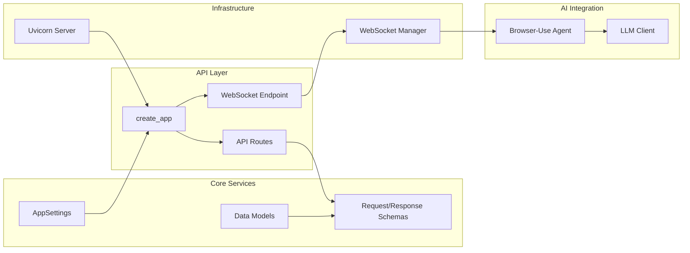
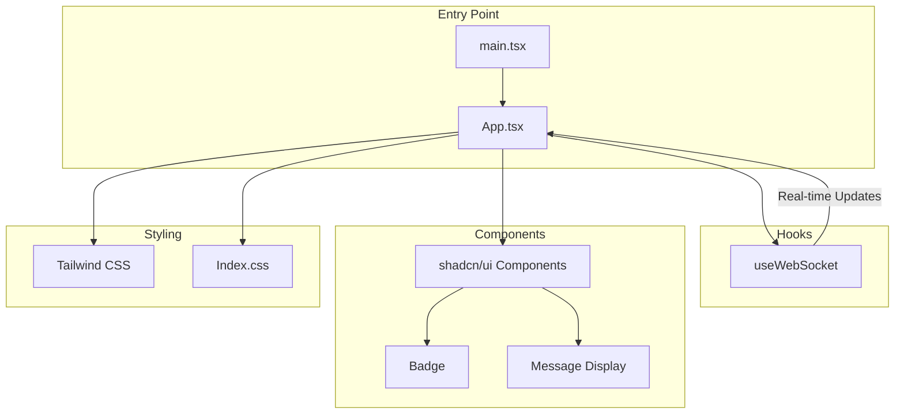

# Purpose

Automate web for QA testing, read input from Jira, Confluence and generate playwright tests.

## Project Structure

- **Backend**: FastAPI + WebSocket (Python)
- **Frontend**: React + TypeScript + Vite
- **AI Integration**: Browser-use + Claude/On-premises LLM
- **Testing**: pytest with coverage
- **Code Quality**: ruff, mypy, pre-commit hooks

## Architecture

### System Overview



### Input: Internal MCP Server

To read from Jira, Confluence on-premises and parse into text

### Open-source Browser-Use

To translate from human language in Jira, Confluence to Playwright test script.
<https://github.com/browser-use/browser-use>

### Backend Architecture



### Frontend Architecture



## LLM Evaluation

<https://github.com/browser-use/benchmark>
<https://browser-use.com/posts/ai-browser-agent-benchmark>

From top to bottom by accuracy:
- Browser Use Cloud: 78% (highest, can bypass Captcha/CloudFlare)
- Claude Opus 4.6: 62%
- Gemini 3.1 Pro: 59.3%
- Claude Sonnet 4.6: 59%
- Gpt-5: 52.4%
- DeepSeek/Qwen: No benchmark but good community feedback

Pricing: <https://browser-use.com/pricing>

### LLM Selection

#### Claude

For PoC, the second in quality with Enterprise license, so best for security

#### On-premises LLMs like DeepSeek, Qwen

Milestone 1, since we have on-premises AI servers with many powerful open-source LLMS, like DeepSeek 670b, Qwen 3.5
The best for security and cost, but no benchmark for quality

#### Browser Use Cloud

Milestone 2, number 1 in quality: the most accurate score, can bypass Captcha and self-healing
Need to evaluate security and cost


## Local Development

### Prerequisites

- Python 3.12+
- Node.js v20+
- uv (Python package manager)

### Installation

1. **Install Python dependencies**
   ```bash
   # Install uv if not already installed
   pip install uv
   
   # Install Python dependencies
   taskkill /IM python.exe /F (close all python.exe processes if have)
   Remove-Item -Recurse -Force .venv (remove .venv folder if outdated)
   uv venv --python 3.14.4 (create new virtual environment)
   .venv\Scripts\activate (activate virtual environment)
   uv sync (install dependencies)
   
   # Install Playwright browsers
   uv run playwright install
   ```

2. **Configure environment**
   ```bash
   # Copy configuration files
   copy .env.example .env
   ```

3. **Set up environment variables**
   
   Edit `.env` file with your API keys:
   ```env
   # Option A: Claude API
   ANTHROPIC_API_KEY=sk-ant-...
   
   # Option B: On-Premises LiteLLM Server
   ON_PREMISES_AI_SERVER_URL=https://your-litellm-server.example.com
   ON_PREMISES_AI_SERVER_KEY=your-api-key
   
   # MCP Integration (if available)
   MCP_SERVER_URL=https://your-mcp-server.example.com
   MCP_SERVER_KEY=your-mcp-key
   ```

4. **Install frontend dependencies**
   ```bash
   cd frontend
   npm install
   ```
   
   > **Important:** Frontend dependencies must be installed inside the `frontend/` directory. Do NOT run `npm install` from the project root, as this will create unnecessary root-level `node_modules/` and `package.json` files that should not be committed.

### Running the Application

1. **Start Backend (FastAPI + WebSocket)**
   ```bash
   # Run backend server
   uv run python -m ai_qa.__main__
   ```
   
   Backend will be available at: `http://localhost:8000`
   WebSocket endpoint: `ws://localhost:8000/ws`

2. **Start Frontend (React + Vite)**
   ```bash
   cd frontend
   npm run dev
   ```
   
   Frontend will be available at: `http://localhost:5173`

### API Testing

Test the API endpoints:
```bash
# Health check
curl http://localhost:8000/health

# WebSocket connection test (using wscat or browser)
```

### Running Tests

```bash
# Run all tests with coverage
uv run pytest

# Run specific tests
uv run pytest tests/test_api.py -v
```

### Code Quality

```bash
# Format code with ruff
uv run ruff format .

# Lint code
uv run ruff check .

# Type checking with mypy
uv run mypy src/
```

### Pre-commit Hooks

The project is configured with pre-commit hooks that automatically run on commit:
- ruff (linting)
- ruff-format (formatting)
- mypy (type checking)

### Troubleshooting

**Port conflicts:**
```bash
# Check which ports are in use
netstat -ano | findstr :8000
netstat -ano | findstr :5173

# Kill process (replace PID with actual process ID)
taskkill /PID <PID> /F
```

**Dependency issues:**
```bash
# Clean reinstall
rm -rf .venv
uv sync
```

**Playwright issues:**
```bash
# Reinstall browsers
uv run playwright install --force
```
