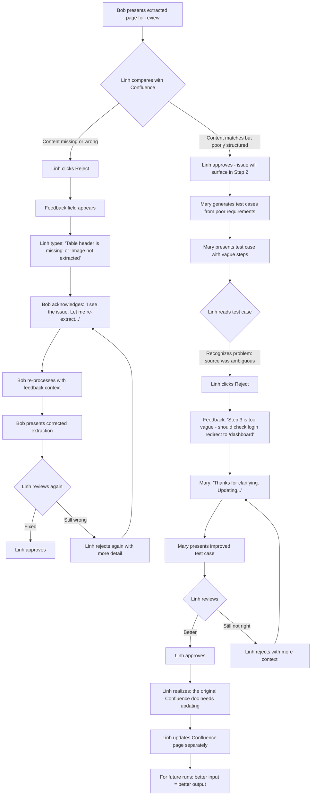
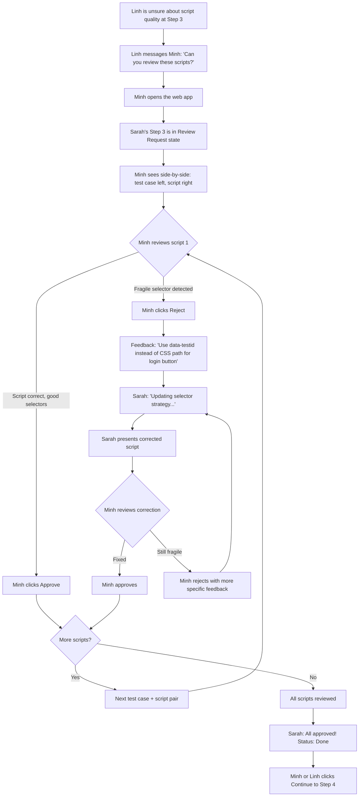
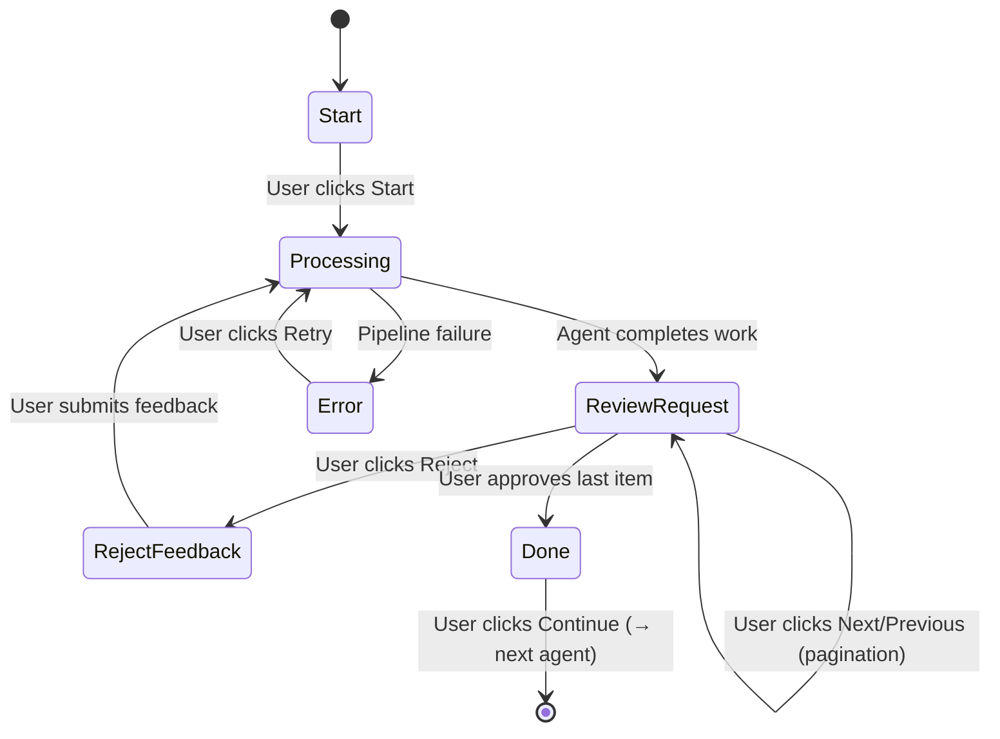

# UX Design Specification AI QA Automation

**Author:** Thuong
**Date:** 2026-04-06

---

## Executive Summary

### Project Vision

AI QA Automation is an AI-powered pipeline that transforms natural-language QA test cases from on-premises Confluence into executable Playwright test scripts. The UX vision centers on one principle: **manual QA testers change nothing about their workflow**. They write test cases in Confluence as they always have — the tool reads their work and produces automation output automatically.

The product evolves across three phases: PoC (IDE-only, single engineer), Milestone 1 (CLI with human-in-the-loop review for the QA team), and Milestone 2+ (web interface for broad organizational access). Each phase expands the user base while preserving the core experience of zero-code, zero-friction test automation.

### Target Users

**Primary — Manual QA Testers (e.g., Linh):**

- Skilled in test design and exploratory testing, zero coding experience
- Daily tools: Confluence and Jira only — no terminal, no IDE, no CLI familiarity
- Work environment: Desktop/laptop, office and remote (corporate VPN — identical experience)
- Core need: See their documented test cases become runnable scripts without writing code
- Key UX requirement: Clear, guided UI — every interaction must be self-explanatory for someone who has never used automation tools

**Secondary — QA Automation Engineers (e.g., Minh):**

- SDET with deep Playwright/Gatling expertise, initially skeptical of AI-generated code
- Reviewer role: validates generated scripts against source test cases before production use
- Core need: Efficient side-by-side review workflow, ability to edit/approve/reject scripts
- Key UX requirement: Technical detail on demand — selectors, assertions, execution logs

**Tertiary — R&D Engineer / Admin (e.g., Duc):**

- Builds and maintains the pipeline, configures LLM providers and MCP connections
- Core need: Configuration management, log monitoring, troubleshooting
- Key UX requirement: Developer-oriented interface — CLI, config files, structured logs

**Stakeholder — Engineering Leadership (e.g., Trang):**

- Business sponsor tracking ROI and adoption metrics
- Core need: Dashboard showing scripts generated, success rates, effort reduction, cost tracking
- Key UX requirement: At-a-glance metrics, exportable reports

### Key Design Challenges

1. **Zero-code barrier is absolute.** Manual testers have never used a terminal or CLI. Every interaction must be fully visual and guided. A single unexplained error message or terminal prompt loses the user entirely.

2. **AI trust gap.** Users who cannot read code must still understand whether AI-generated scripts are correct. The UX must bridge the gap between natural-language test cases and generated Playwright scripts — especially when scripts fail. Reviewers (automation engineers) need efficient side-by-side comparison to validate at scale.

3. **Progressive interface complexity.** The product evolves from IDE (PoC) to CLI (M1) to web interface (M2+). Each phase introduces new users with different technical skill levels. UX must evolve without breaking mental models established in earlier phases.

4. **Human-friendly error communication.** Pipeline failures (MCP unavailable, LLM timeout, browser crash) must be translated into actionable, non-technical language for manual testers. Technical details available on demand for engineers.

### Design Opportunities

1. **Guided first-run experience.** A step-by-step onboarding flow — paste Confluence URL, watch progress, receive scripts — creates the "aha moment" for testers who assumed AI tools were "for developers only." Simplicity of copy-paste as the primary interaction.

2. **Confidence visualization.** Visual confidence scoring (green/yellow/red) per generated script lets testers immediately identify which scripts are trustworthy and which need expert review. Transforms AI opacity into actionable transparency.

3. **Documentation quality feedback loop.** When AI encounters ambiguous or poorly structured test cases, the UX highlights the specific problematic sections — helping testers improve their documentation quality over time. The tool becomes a forcing function for better test documentation across the organization.

## Core User Experience

### Defining Experience

The core experience is a **5-step AI agent wizard** where each step is handled by a named AI agent persona. Manual QA testers interact with a consistent, repeating UI pattern — one popup per step — guiding them through the full pipeline from AI provider configuration to executed test reports.

**Core Action:** Choose AI provider → paste Confluence URL → walk through 5 guided steps → receive test execution reports. Each step follows the same interaction model: provide input (if needed) → Start → watch progress → Review AI output → Approve or Reject with feedback → Continue.

**The 5-Step Pipeline:**

| Step | Agent | Task | Input | Output Folder |
| --- | --- | --- | --- | --- |
| 1/5: Configuration | Alice | Guide user to select AI provider and configure credentials | AI provider selection, API key or server URL | `configuration/` |
| 2/5: Extract Requirements | Bob | Load Confluence/Jira content, convert to LLM-friendly format (MD, Mermaid, images) | Confluence URL (required), Jira URL (optional) | `requirements/` |
| 3/5: Create Test Cases | Mary | Generate natural-language test cases optimized for browser-use from requirements | None (reads `requirements/`) | `testcases/` |
| 4/5: Create Test Scripts | Sarah | Generate Playwright Python scripts from test cases, using vision model for locators | Chrome path | `testscripts/` |
| 5/5: Run Test Scripts | Jack | Execute test scripts across selected browsers, generate reports | Edge/Safari/Firefox paths (optional) | `report/` |

**AI Provider Selection (Step 1 — drives all subsequent agents):**

| Provider | Quality Rank | Security | Credential | Model Assignment |
| --- | --- | --- | --- | --- |
| Browser Use Cloud | 1st (78% benchmark) | Unclear — cloud, not enterprise-grade | Personal API key (company has no license) | Browser Use Cloud models for all agents |
| Claude | 2nd (62% benchmark) | Enterprise license available, IT-limited API key access | API key (limited accounts), SSO enterprise login (TBD) | Bob→Opus, Mary→Sonnet, Sarah→Sonnet, Jack→Sonnet |
| Gemini / ChatGPT | 3rd | Cloud, personal use | Personal API key | Gemini Pro or GPT models per agent |
| On-Premises | 4th (lowest quality) | Highest — all data stays on-prem | Server domain URL + API key | Bob→DeepSeek, Mary→Qwen, Sarah→Qwen, Jack→Qwen |

**Named AI Agents as UX Strategy:** Each agent has a name and clear responsibility, creating a sense of collaboration between human and AI team members. Testers don't interact with abstract "AI" — they work with Alice, Bob, Mary, Sarah, and Jack.

### Platform Strategy

**Phase 1 (PoC/M1) — Local Web Application:**

- Web UI running on localhost — accessible via browser on desktop/laptop
- Single tester per instance — no multi-user complexity
- Office and remote environments identical (corporate VPN)
- No installation beyond Python/uv — runs locally with `uv run`

**Phase 2 (M2+) — Internal Server Deployment:**

- Deployed on company on-premises infrastructure
- Multi-user support with authentication
- Shared pipeline runs and report history
- Team-level metrics and dashboards

**Platform Constraints:**

- Desktop/laptop only — no mobile requirement
- Mouse/keyboard interaction — no touch optimization needed
- Online-only — VPN required for MCP server access, no offline mode

### Effortless Interactions

**Completely Automatic (zero user thought):**

- MCP server connection and SSO authentication reuse
- LLM model selection (system picks optimal model per task)
- File format conversion (Confluence → MD/Mermaid/images)
- Output folder organization (`requirements/` → `testcases/` → `testscripts/` → `report/`)
- Confidence scoring and quality assessment
- Browser automation setup and teardown

**Guided but Minimal (one-time setup):**

- Step 1: AI provider selection + credentials — done once, remembered
- Step 2: MCP PAT configuration via guidance text — done once, remembered
- Step 4: Local Chrome path — done once, remembered
- Step 5: Browser paths — done once, remembered

**Consistent UI Pattern (learn once, use everywhere):**
Every step uses identical layout:

- Header: Step number/total, step title
- Agent info: Agent name, task description
- Guidance: Context-specific instructions for the user
- Input fields: Step-specific (if any)
- Status indicator: Start → Processing → Review Request → Done
- Action buttons: Start / Approve+Reject (with feedback field) / Continue

### Critical Success Moments

**Onboarding Moment — Step 1 Configuration:**
Linh opens the app for the first time. Alice greets her, explains the tool, and asks which AI provider to use. Alice presents clear options with quality/security trade-offs. Linh picks one, enters credentials, Alice confirms connection. This takes 2 minutes and never needs to be repeated.

**Make-or-Break Moment — First Run of Step 2:**
Linh pastes her Confluence URL, clicks Start, watches Bob extract content, then sees her familiar test documentation converted into clean markdown in the `requirements/` folder. If this first interaction is confusing or fails without clear explanation, trust is lost permanently.

**Trust-Building Moment — First Review Request:**
When Bob presents extracted requirements for review, Linh compares them against her original Confluence page. She spots a minor formatting issue, clicks Reject with feedback "table header is missing," and Bob fixes it. This moment proves the human is in control — AI proposes, human decides.

**Aha Moment — Step 3 Completion:**
Mary generates structured test cases from Linh's requirements. Linh reads them and thinks "this is exactly what I would have written for the automation team." The AI understood her intent. This is where adoption clicks.

**Validation Moment — Step 5 Reports:**
Jack runs scripts across Chrome, Firefox, and Edge. Reports show 9/12 tests pass, with clear failure details. Linh sees her documentation work produce real, multi-browser test coverage — in an afternoon instead of weeks.

**Rejection Recovery — Agent Self-Correction:**
When Linh rejects at any step with feedback, the agent uses her feedback to self-correct and re-presents. The loop feels collaborative, not adversarial. Testers learn that rejection is part of the workflow, not a failure.

### Experience Principles

1. **One pattern, five steps.** Every step uses the same UI layout and interaction model. Testers learn the pattern once in Step 1 and apply it through Step 5. Consistency eliminates cognitive load.

2. **Human approves, AI proposes.** No output advances to the next step without explicit human approval. The Review Request state is mandatory at every step — this is how non-technical users build trust in AI-generated output.

3. **Named agents, clear responsibilities.** Alice configures, Bob extracts, Mary designs, Sarah codes, Jack runs. Testers understand who does what. Agent names make the pipeline feel like a team, not a black box.

4. **Reject is a feature, not a failure.** Every rejection includes a feedback field. Agents use feedback to self-correct. This teaches testers that their domain expertise drives the output quality — they are the quality gate.

5. **Transparent file pipeline.** Each step reads from the previous folder and writes to the next: `configuration/` → `requirements/` → `testcases/` → `testscripts/` → `report/`. Testers can open any folder and see exactly what the AI produced. No hidden state, no magic.

6. **Provider choice drives everything.** Alice's configuration in Step 1 determines which AI models all subsequent agents use. One decision, propagated automatically — the user never thinks about models again.

## Desired Emotional Response

### Primary Emotional Goals

**Primary: In Control.** Linh must feel that she is the decision-maker at every step. AI agents propose, but she approves or rejects. The tool amplifies her expertise — it does not replace her judgment. The 4-step wizard with mandatory review at each stage reinforces this: nothing happens without her explicit approval.

**During Errors: Guided.** When something goes wrong — MCP timeout, AI generates incorrect output, script fails — the user should never feel lost or blamed. The tool explains what happened in plain language, suggests what to do next, and offers a clear path forward. Errors are expected events with guided recovery, not dead ends.

**Long-term: Routine.** By the 3rd or 10th use, the tool should feel like a natural part of the daily workflow — as unremarkable as opening Confluence. No friction, no surprises, no re-learning. The consistent 4-step pattern becomes muscle memory: paste URL, walk through steps, collect reports.

### Emotional Journey Mapping

| Stage | Desired Emotion | Design Implication |
| --- | --- | --- |
| First discovery | Curiosity, not intimidation | Clean UI, no technical jargon, named agents feel approachable |
| First run (Step 1) | In control — "I understand what's happening" | Clear status indicator, guided instructions, familiar Confluence content in review |
| Review request | Confidence — "I can judge this" | Side-by-side comparison with source, plain-language summaries |
| Rejection + feedback | Empowered — "My feedback matters" | Agent visibly self-corrects based on feedback, re-presents improved output |
| Step completion | Accomplishment — "I did this" | Clear "Done" state, visible output in folder |
| Pipeline error | Guided — "I know what to do next" | Human-friendly error message, suggested action, no stack traces |
| First config (Step 1) | Guided — "Alice is helping me set up" | Clear provider comparison, simple selection, credentials saved |
| Returning user (10th run) | Routine — "Just another Tuesday" | Remembered settings (incl. provider), fast start, no re-onboarding |

### Micro-Emotions

**Critical to achieve:**

- **Confidence over confusion:** Every UI element is self-explanatory. Guidance text explains what the agent will do before the user clicks Start
- **Trust over skepticism:** Review Request state exists at every step — the user verifies before anything advances. Trust is earned incrementally, step by step
- **Accomplishment over frustration:** Each step ends with a clear "Done" state and visible output. Four small wins build to one big outcome

**Critical to avoid:**

- **Anxiety:** "What is the AI doing?" → Mitigate with real-time status updates and progress indicators during Processing state
- **Helplessness:** "It broke and I don't know why" → Mitigate with guided error messages that suggest specific next actions
- **Overwhelm:** "Too many options, too much information" → Mitigate with progressive disclosure — show only what's needed at each state

### Design Implications

**In Control → UX Choices:**

- Mandatory Review Request state at every step — no auto-advance
- Approve/Reject buttons are the primary actions, always visible and prominent
- Reject always includes feedback field — user's voice shapes the output
- Each step shows exactly what the agent will do (Task description) before Start

**Guided → UX Choices:**

- Guidance text block in every step popup — context-specific instructions
- Error messages in plain language: what happened, why, what to do next
- No technical jargon in primary UI — technical details available in expandable sections for engineers
- Step numbering (1/4, 2/4...) provides constant orientation

**Routine → UX Choices:**

- One-time inputs (PAT, Chrome path, browser paths) are remembered across sessions
- Consistent layout across all 4 steps — zero re-learning
- Fast start for returning users — previous settings pre-filled
- No onboarding popups or tutorials after first successful run

### Emotional Design Principles

1. **Control is non-negotiable.** Every AI output requires human approval. The user is never a passenger — they are the pilot. Design every interaction to reinforce this.

2. **Errors are conversations, not failures.** When something goes wrong, the UI responds as a helpful colleague would: "Here's what happened, here's what I suggest." Never show raw errors, never leave the user without a next step.

3. **Familiarity breeds adoption.** The 4-step pattern, the consistent layout, the remembered settings — repetition builds comfort. By the 10th run, the tool should feel invisible. The best UX is the one users stop noticing.

## UX Pattern Analysis & Inspiration

### Inspiring Products Analysis

### 1. Microsoft Teams — Familiar Enterprise UI

Teams is the daily communication tool for company's QA testers. UX patterns worth analyzing:

- **Card-based layout:** Messages, tasks, and notifications presented as contained cards with clear boundaries — maps well to our step popup pattern
- **Status indicators:** Presence dots (green/yellow/red) are universally understood — transferable to pipeline status and confidence scoring
- **Tab-based navigation:** Simple top-level tabs for switching context without losing state
- **Notification patterns:** Non-intrusive banners for status updates, no modal interruptions during work
- **Familiar to every target user:** Zero learning curve for visual language borrowed from Teams

### 2. BMAD Framework — AI Agent + Human Review Workflow (Primary Inspiration)

BMAD is a CLI-based AI agent orchestration framework that the stakeholder identifies as the best reference for AI-human collaboration UX. Despite having no visual UI, its workflow patterns are the direct blueprint for AI QA Automation:

- **Named agent personas:** Each agent has a name, role, and clear responsibility — creates collaborative relationship between human and AI
- **Step-by-step progression:** Work advances through discrete, numbered steps with clear boundaries
- **Human review gates:** Every AI output requires explicit human approval before advancing — the A/P/C (Advanced/Party/Continue) menu pattern
- **Reject with feedback:** When output is insufficient, human provides feedback and agent self-corrects — iterative refinement loop
- **Transparent artifacts:** All outputs are visible files (markdown documents) — no hidden state
- **Context preservation:** Each step builds on previous steps, maintaining cumulative context

**Why BMAD is the primary inspiration:** It proves that named agents + mandatory human review + feedback-driven correction creates trust in AI output — even for complex, multi-step workflows. The challenge is translating these CLI patterns into a visual web UI that non-technical users can operate.

### Transferable UX Patterns

**Navigation Patterns:**

- **Teams → Step popup as card:** Each wizard step presented as a self-contained card (like a Teams message card) with header, body, and action buttons. Familiar visual container for testers
- **BMAD → Linear progression with step counter:** Step 1/4, 2/4, 3/4, 4/4 — clear orientation at all times. No branching, no complex navigation

**Interaction Patterns:**

- **BMAD → Review-before-advance gate:** The core interaction pattern. AI produces output → status changes to "Review Request" → user Approves or Rejects with feedback → agent corrects or advances. Direct translation of BMAD's A/P/C menu into visual buttons
- **BMAD → Reject + feedback loop:** Text field appears on Reject, agent uses feedback to self-correct. This is the trust-building mechanism — proven in BMAD's CLI workflow
- **Teams → Status dots for pipeline state:** Start (grey), Processing (yellow pulse), Review Request (blue), Done (green). Universally understood color language

**Visual Patterns:**

- **Teams → Clean, low-density layout:** White space, clear typography, no visual clutter. Testers are not power users — they need breathing room
- **BMAD → Transparent file output:** Each step's output folder is browsable — `requirements/`, `testcases/`, `testscripts/`, `report/`. Like BMAD's markdown artifacts, everything is inspectable

### Anti-Patterns to Avoid

- **Terminal/console output in UI:** Even read-only log streams feel intimidating to non-technical users. Pipeline processing must be abstracted into status indicators and progress bars — never raw output
- **Auto-advance without approval:** Some AI tools automatically proceed when generation completes. This destroys the "in control" feeling. Every step MUST pause at Review Request
- **Complex configuration screens:** Multi-tab settings pages with dozens of fields overwhelm testers. Configuration should be minimal (guidance text + input fields in the step popup itself) and remembered after first use
- **Generic AI branding:** "AI is processing..." feels impersonal and opaque. Named agents (Bob, Mary, Sarah, Jack) with specific task descriptions make the same process feel collaborative and transparent
- **Modal overload:** Nested modals, confirmation dialogs on top of dialogs. Each step is one popup — no nesting, no stacking

### Design Inspiration Strategy

**What to Adopt (directly):**

- BMAD's named agent + human review gate pattern → core wizard interaction model
- BMAD's reject + feedback correction loop → Reject button with feedback field
- Teams' status dot color language → pipeline status indicators
- Teams' card-based containment → step popup layout

**What to Adapt (modify for context):**

- BMAD's CLI text output → visual cards with structured sections (Agent Name, Task, Guidance, Input, Status, Actions)
- BMAD's A/P/C menu → visual buttons (Start / Approve / Reject / Continue) with state-dependent visibility
- BMAD's markdown artifacts → browsable folder view with file previews for review

**What to Avoid (conflicts with goals):**

- Any pattern requiring terminal interaction — absolute barrier for target users
- Complex navigation structures — 4 linear steps is the entire product
- Dense information displays — progressive disclosure only, details on demand

## Design System Foundation

### Design System Choice

### Selected: Shadcn/ui + Tailwind CSS + React

A copy-paste component library built on Radix UI primitives with Tailwind CSS styling. Components are owned by the project (not external dependencies), minimal by default, and exceptionally well-documented — making them ideal for AI-assisted code generation.

### Rationale for Selection

**Why Shadcn/ui over alternatives:**

| Criterion | Shadcn/ui | Ant Design | MUI | Streamlit |
| --- | --- | --- | --- | --- |
| Visual simplicity | Minimal by default — matches "simplest possible" requirement | Enterprise-heavy, visual overhead | Material Design opinions, more complex | Simple but very limited |
| AI code generation | Excellent — Claude/Copilot generate accurate Shadcn code due to clear documentation | Good but verbose API surface | Good but theme complexity | Python-native, no React |
| Customization | Full ownership — components are in your codebase | Theme overrides, can fight defaults | Theme provider, complex customization | Very limited |
| Bundle size | Minimal — only include what you use | Large — many unused components bundled | Medium-large | N/A |
| Learning curve for Python dev | Low — components are simple, Tailwind is utility-first | Medium — Ant Design API is extensive | Medium — Material Design system is deep | Lowest (but dead-end for M1+) |
| Long-term scalability | High — full React, grows with project | High | High | Low — rewrite needed for M1 |

**Key decision drivers:**

1. **AI-first development:** Duc is a Python engineer — frontend code will be primarily AI-generated. Shadcn/ui has the highest AI code generation accuracy due to simple, well-documented component APIs
2. **Minimal UI requirement:** Internal tool on PC — no need for enterprise design system weight. Shadcn/ui is unstyled by default, add only what's needed
3. **React investment from day one:** No Streamlit PoC → React rewrite. Build once on React, evolve through milestones
4. **Component ownership:** Components live in the project codebase, not in node_modules. Full control, no breaking updates from upstream

### Frontend Stack & Implementation

**Frontend Stack:**

- **React 19+** — UI framework
- **TypeScript** — type safety for AI-generated code (catches errors early)
- **Tailwind CSS** — utility-first styling, no custom CSS files needed
- **Shadcn/ui** — component library (Card, Button, Input, Badge, Progress, Dialog)
- **Vite** — build tool (fast, minimal config)

**Backend Integration:**

- **FastAPI** (Python) — REST API backend serving the pipeline
- **React frontend** served as static files or via Vite dev server
- Communication via REST API endpoints

**Key Components Needed (mapped to wizard UI):**

| Wizard Element | Shadcn/ui Component | Purpose |
| --- | --- | --- |
| Step popup | Card + CardHeader + CardContent + CardFooter | Main step container |
| Step counter | Badge or custom stepper | "Step 1/4" orientation |
| Agent name & task | CardTitle + CardDescription | Agent identity |
| Guidance text | Alert (info variant) | Context-specific instructions |
| Input fields | Input + Label | Confluence URL, Chrome path, etc. |
| Status indicator | Badge with color variants | Start/Processing/Review/Done |
| Action buttons | Button (variant: default, destructive, outline) | Start/Approve/Reject/Continue |
| Feedback field | Textarea | Rejection reason input |
| Progress | Progress bar | Processing state animation |
| File preview | ScrollArea + code block | Review Request content display |

### Customization Strategy

**Design Tokens (Tailwind config):**

- **Colors:** Minimal palette — primary (blue), success (green), warning (yellow), error (red), neutral (grey). Matches Teams-inspired status dots
- **Typography:** System font stack (no custom fonts) — fastest load, familiar to OS users
- **Spacing:** Tailwind defaults — consistent 4px grid
- **Border radius:** Subtle rounding (rounded-lg) — clean, modern, non-distracting

**Customization Principles:**

1. **Use defaults aggressively.** Shadcn/ui defaults are clean and minimal — customize only when the wizard pattern demands it
2. **No custom CSS.** Everything through Tailwind utilities — AI can generate and maintain this reliably
3. **Consistent component variants.** Define once (e.g., status badge colors), reuse across all 4 steps
4. **Dark mode: deferred.** Light mode only for PoC/M1 — add dark mode in M2 if users request it

## Detailed Core Experience

### Core Interaction Flow

#### "Paste link, 4 agents do all, I just need to review and approve."

The defining experience of AI QA Automation is a 5-step AI agent pipeline where the user's only actions are: provide a URL, review each stage's output, and approve or reject with feedback. The tool transforms the traditional 2-3 week handoff between manual QA and automation QA into an afternoon of guided, AI-assisted collaboration.

Quality over speed is the governing principle — users accept any processing time as long as the output is trustworthy and reviewable.

### User Mental Model

**Current workflow (what users know):**

1. Linh writes test cases in Confluence (her expertise, her daily work)
2. She submits a request to the automation team
3. She waits 2-3 weeks
4. She receives automated scripts she cannot read or verify
5. She trusts the automation engineer's judgment

**New mental model (what the tool introduces):**

1. Linh pastes her Confluence URL into the tool
2. She reviews AI-extracted requirements against her original page (she can verify — it's her content)
3. She reviews AI-generated test cases (she can verify — it's her domain expertise)
4. She reviews AI-generated scripts alongside natural-language test cases (she starts learning)
5. She sees test execution reports across browsers (she sees the final outcome)

**Key mental model shift:** From "hand off and wait" to "guide and approve." Linh moves from passive requester to active quality gate. She can verify steps 1-2 with full confidence (her domain), partially verify step 3 (learning opportunity), and validate step 4 (results are self-evident).

### Success Criteria

**Core interaction succeeds when:**

- User completes all 4 steps without asking for help (guidance text is sufficient)
- User understands what each agent produced during Review Request (output is self-explanatory)
- User feels confident approving or rejecting (not guessing)
- User can explain what the tool does to a colleague in one sentence
- Quality of output justifies the time invested — no pressure on speed

**Success indicators per step:**

| Step | User feels successful when... |
| --- | --- |
| Step 1 | AI provider connected, model assignment makes sense — "Alice set it up for me" |
| Step 2 | MD output matches Confluence page content — "Bob got it right" |
| Step 3 | Test cases read like what she would have written — "Mary understands my intent" |
| Step 4 | Script structure visibly maps to test case steps — "I can see the connection" |
| Step 5 | Report shows clear pass/fail per browser — "I know what works and what doesn't" |

### Novel UX Patterns

**Pattern type: Established patterns combined in a novel context.**

The individual patterns are all proven:

- Wizard/stepper UI — established (setup wizards, onboarding flows)
- Side-by-side comparison — established (diff viewers, code review tools)
- Approve/reject with feedback — established (BMAD, PR review workflows)
- Named AI agents — emerging but proven in BMAD framework

**The novel combination:** A 4-step wizard where each step has a named AI agent, mandatory human review with side-by-side comparison, and feedback-driven self-correction. No existing QA tool combines these patterns.

**No user education needed for the interaction model** — the wizard pattern is universally understood. Education happens organically: Step 3's side-by-side view (test case ↔ script) gradually teaches manual testers to read Playwright code through pattern recognition.

### Experience Mechanics

#### Step 1: Configuration (Agent Alice)

**Initiation:**

- Alice greets the user and explains the tool's purpose
- Before presenting AI provider options, Alice resolves the authenticated user's project context:
  - If the user has zero accessible projects, Alice says: "You do not have access to any project yet. Please contact an administrator to assign you to a project." Alice does not show AI provider selection.
  - If the user has exactly one accessible project, Alice says: "You have only one project called <project name>. Auto proceed with this project." Alice automatically selects that project.
  - If the user has two or more accessible projects, Alice says: "Please select one project to proceed" and renders a selectable list of project names.
  - When the user clicks a project, the chat adds a right-aligned user message with the selected project name.
- After project context has been resolved, Alice presents AI provider options with clear comparison:
  - **Browser Use Cloud** — "Highest quality (78% benchmark), but uses cloud servers. Requires personal API key — company doesn't have a license. Security not enterprise-grade."
  - **Claude** — "Second highest quality (62% benchmark). Needs API key — limited accounts, IT may restrict access. SSO enterprise login may be available."
  - **Gemini / ChatGPT** — "Good quality. Requires personal API key from Google or OpenAI."
  - **On-Premises** — "Highest security — all data stays on your infrastructure. Lower quality than cloud options. Needs server URL and API key."
- User selects a provider

**Interaction:**

- Based on selection, Alice asks for required credentials:
  - **Browser Use Cloud:** API key input field
  - **Claude:** API key input field (+ SSO login option if available)
  - **Gemini / ChatGPT:** API key input field + model selection (Gemini Pro / GPT)
  - **On-Premises:** Server domain URL + API key (pre-filled from `.env` if available)
- Alice tests the connection to verify credentials work
- Status: **Processing** while testing connection

**Review:**

- Status: **Review Request**
- Alice confirms: "Connected successfully to [provider]. Here's what I'll use for each step:"
  - Shows model assignment table (e.g., "Bob → Claude Opus, Mary → Claude Sonnet...")
- User clicks **Approve** to confirm, or **Reject** to change provider

**Completion:**

- Alice saves complete configuration to `configuration/` folder:
  - `provider.json` — selected AI provider, credentials (API key encrypted or reference), connection status
  - `agents.json` — per-agent configuration: agent name, assigned model, prompt template reference, tools/capabilities
  - Example `agents.json` structure: `{ "bob": { "model": "claude-opus", "prompt": "extract_requirements_v1", "tools": ["mcp_confluence", "content_parser"] }, "mary": { ... } }`
- Configuration remembered for future sessions — subsequent runs skip Step 1 unless user wants to reconfigure
- Status: **Done**
- User clicks **Continue** to advance to Step 2
- Alice: "Great! Bob will take it from here. Your AI provider is set up and ready."

**Configuration Output Files (`configuration/` folder):**

| File | Content | Used By |
| --- | --- | --- |
| `provider.json` | AI provider name, API endpoint, credential reference, connection test result | All agents — determines which LLM API to call |
| `agents.json` | Per-agent config: model name, prompt template, tools list, parameters | Each agent reads its own section at startup |

**Provider → Model Assignment (internal, shown to user in review):**

| Provider | Bob (Extract) | Mary (Test Cases) | Sarah (Scripts) | Jack (Run) |
| --- | --- | --- | --- | --- |
| Browser Use Cloud | BU Cloud model | BU Cloud model | BU Cloud model | BU Cloud model |
| Claude | Claude Opus | Claude Sonnet | Claude Sonnet | Claude Sonnet |
| Gemini | Gemini Pro | Gemini Pro | Gemini Pro | Gemini Pro |
| ChatGPT | GPT latest | GPT latest | GPT latest | GPT latest |
| On-Premises | DeepSeek | Qwen | Qwen | Qwen |

#### Step 2: Extract Requirements (Agent Bob)

**Initiation:**

- User enters Confluence project URL (required) and Jira project URL (optional)
- Guidance text: instructions to configure MCP PAT if first time
- User clicks **Start**

**Interaction:**

- Status changes to **Processing** with progress indicator
- Bob connects to MCP server, navigates Confluence space, extracts content
- Converts to LLM-friendly formats: Markdown for text, Mermaid for diagrams, images preserved

**Review (per page — paginated):**

- Status changes to **Review Request**
- **Left panel:** Confluence page rendered as web view (iframe with SSO, fallback: open in new browser tab if iframe blocked by on-prem security policies)
- **Right panel:** Extracted MD file rendered with rich markdown viewer (rendered HTML, not raw markdown — QA testers don't know markdown syntax)
- **Navigation:** Next/Previous buttons to step through each Confluence page
- User reviews each page, then clicks **Approve** or **Reject** (with feedback field)

**Completion:**

- All pages approved → Status changes to **Done**
- Output: `requirements/` folder with MD files, Mermaid diagrams, images
- User clicks **Continue** to advance to Step 3

#### Step 3: Create Test Cases (Agent Mary)

**Initiation:**

- No user input needed — Mary reads from `requirements/` folder
- User clicks **Start**

**Interaction:**

- Status: **Processing**
- Mary generates natural-language test cases optimized for browser-use execution
- Each test case is structured, readable, and maps to source requirements

**Review (per test case — one at a time):**

- Status: **Review Request**
- Single test case displayed with clear structure: title, preconditions, steps, expected results
- Navigation: Next/Previous to step through test cases
- User reviews each test case against their domain knowledge
- **Approve** or **Reject** (with feedback — Mary self-corrects and re-presents)

**Completion:**

- All test cases approved → Status: **Done**
- Output: `testcases/` folder
- User clicks **Continue**

#### Step 4: Create Test Scripts (Agent Sarah)

**Initiation:**

- User inputs local Chrome path (remembered after first time)
- User clicks **Start**

**Interaction:**

- Status: **Processing**
- Sarah generates Playwright Python scripts from test cases
- Uses vision model for accurate locator identification on first run

**Review (per script — side-by-side):**

- Status: **Review Request**
- **Left panel:** Natural-language test case (from Step 2)
- **Right panel:** Generated Playwright Python script with syntax highlighting
- Navigation: Next/Previous to step through each test case + script pair
- QA manual testers have three options:
  1. **Approve** if the script structure visibly maps to test case steps
  2. **Reject** with feedback if something looks wrong
  3. Skip review and ask QA automation engineer (Minh) to review instead
- This step is an organic learning opportunity — testers gradually learn to read code through repeated side-by-side exposure

**Completion:**

- All scripts approved → Status: **Done**
- Output: `testscripts/` folder with `.py` Playwright files
- User clicks **Continue**

#### Step 5: Run Test Scripts (Agent Jack)

**Initiation:**

- User inputs browser paths: Edge, Safari, Firefox (optional, remembered after first time)
- User selects which browsers to run (checkboxes)
- User clicks **Start**

**Interaction:**

- Status: **Processing**
- Jack executes test scripts across selected browsers
- Progress shows per-script, per-browser execution status

**Review:**

- Status: **Review Request**
- Report displayed as-is from browser-use execution output (no custom formatting — preserve original report format)
- Shows pass/fail results per test case per browser

**Completion:**

- User clicks **Approve** to accept report, or **Reject** to re-run with feedback
- Status: **Completed**
- Output: `report/` folder with execution reports
- Final button: **Completed** (not Continue — this is the last step of 5)

## Visual Design Foundation

### Color System

**Theme: "Professional Calm"** — neutral-dominant with blue accent. Designed to feel trustworthy, unobtrusive, and familiar to Microsoft Teams users.

**Core Palette:**

| Role | Color Name | Hex | Tailwind Class | Usage |
| --- | --- | --- | --- | --- |
| Primary | Slate Blue | `#3B82F6` | `blue-500` | Action buttons (Start, Continue), links, active states, primary accent |
| Primary Hover | Dark Blue | `#2563EB` | `blue-600` | Button hover states |
| Background | White | `#FFFFFF` | `white` | Page background |
| Surface | Light Slate | `#F8FAFC` | `slate-50` | Card backgrounds, side panels |
| Border | Soft Grey | `#E2E8F0` | `slate-200` | Card borders, dividers, input borders |
| Text Primary | Dark Slate | `#0F172A` | `slate-900` | Headings, body text, agent names |
| Text Secondary | Medium Slate | `#64748B` | `slate-500` | Descriptions, labels, guidance text |
| Text Muted | Light Slate | `#94A3B8` | `slate-400` | Placeholders, disabled text |

**Semantic Colors (status and feedback):**

| Role | Color Name | Hex | Tailwind Class | Usage |
| --- | --- | --- | --- | --- |
| Success | Green | `#22C55E` | `green-500` | Done/Completed status, Approve button, test pass |
| Success Light | Light Green | `#F0FDF4` | `green-50` | Success background tint |
| Warning | Amber | `#F59E0B` | `amber-500` | Processing status, low confidence indicators |
| Warning Light | Light Amber | `#FFFBEB` | `amber-50` | Warning background tint |
| Error | Red | `#EF4444` | `red-500` | Reject button, test fail, error messages |
| Error Light | Light Red | `#FEF2F2` | `red-50` | Error background tint |
| Info | Blue | `#3B82F6` | `blue-500` | Review Request status, guidance alerts |
| Info Light | Light Blue | `#EFF6FF` | `blue-50` | Info background tint |

**Status Badge System:**

| Wizard Status | Badge Color | Badge Style | Indicator |
| --- | --- | --- | --- |
| Start | Grey (`slate-400`) | `outline` variant | Static grey dot |
| Processing | Amber (`amber-500`) | `default` variant | Pulsing amber dot (CSS animation) |
| Review Request | Blue (`blue-500`) | `default` variant | Solid blue dot |
| Done | Green (`green-500`) | `default` variant | Solid green dot + checkmark |
| Completed | Green (`green-500`) | `default` variant | Solid green dot + checkmark (Step 5 only) |

**Color Rationale:**

- Slate blue primary aligns with Microsoft Teams' visual language — familiar to every target user
- Neutral grey dominance supports "routine" emotional goal — the tool fades into the background over time
- High-contrast status colors (green/amber/red/blue) provide instant orientation without reading text
- Light tint backgrounds for status feedback — non-intrusive but visible

### Typography System

**Font Stack:** System fonts only — no custom web fonts.

```css
font-family: ui-sans-serif, system-ui, -apple-system, BlinkMacSystemFont, "Segoe UI", Roboto, "Helvetica Neue", Arial, sans-serif;
```

**Rationale:** Zero load time, familiar to OS, renders natively on Windows (Segoe UI) and Mac (SF Pro). Internal tool on PC — no brand differentiation needed through typography.

**Type Scale (Tailwind defaults):**

| Element | Tailwind Class | Size | Weight | Usage |
| --- | --- | --- | --- | --- |
| Step Title | `text-xl` | 20px | `font-semibold` (600) | "Step 1/4: Extract Requirements" |
| Agent Name | `text-lg` | 18px | `font-medium` (500) | "Agent: Bob" |
| Task Description | `text-base` | 16px | `font-normal` (400) | Agent task text |
| Guidance Text | `text-sm` | 14px | `font-normal` (400) | Guidance alert content |
| Input Labels | `text-sm` | 14px | `font-medium` (500) | Form field labels |
| Body Text | `text-base` | 16px | `font-normal` (400) | Review content, test cases |
| Code (scripts) | `text-sm font-mono` | 14px | `font-normal` (400) | Playwright script display |
| Button Text | `text-sm` | 14px | `font-medium` (500) | Action button labels |
| Status Badge | `text-xs` | 12px | `font-medium` (500) | Status indicator text |

**Line Height:** Tailwind default `leading-normal` (1.5) for body text, `leading-tight` (1.25) for headings. Comfortable reading for review-heavy workflow.

**Monospace Font (for code display in Step 3):**

```css
font-family: ui-monospace, SFMono-Regular, "SF Mono", Menlo, Consolas, "Liberation Mono", monospace;
```

### Spacing & Layout Foundation

**Base Unit:** 4px (Tailwind default). All spacing derived from multiples of 4px.

**Layout Strategy: Single-column centered with split panels for review.**

**Page Layout:**

- Max width: `max-w-4xl` (896px) for single-panel views, `max-w-6xl` (1152px) for split-panel review
- Centered on page: `mx-auto`
- Page padding: `p-6` (24px) on all sides
- Generous whitespace — desktop has abundant space, no need for density

**Card Layout (Step Popup):**

| Element | Spacing | Tailwind |
| --- | --- | --- |
| Card padding | 24px | `p-6` |
| Section gap (between header, content, footer) | 16px | `space-y-4` |
| Input field gap | 12px | `space-y-3` |
| Button group gap | 8px | `gap-2` |
| Card border radius | 8px | `rounded-lg` |
| Card shadow | Subtle | `shadow-sm` |

**Split Panel Layout (Review States):**

| Element | Specification | Tailwind |
| --- | --- | --- |
| Panel split | 50/50 | `grid grid-cols-2` |
| Panel gap | 16px | `gap-4` |
| Panel padding | 16px | `p-4` |
| Panel border | Right border on left panel | `border-r border-slate-200` |
| Panel min-height | 400px | `min-h-[400px]` |
| Panel scroll | Independent scroll per panel | `overflow-y-auto` |

**Responsive Strategy:** Desktop-only for PoC/M1. No responsive breakpoints needed. Fixed layout optimized for 1280px+ screens. Responsive design deferred to M2 if server deployment requires tablet/mobile support.

### Accessibility Considerations

**Color Contrast (WCAG 2.1 AA compliance):**

| Combination | Contrast Ratio | Status |
| --- | --- | --- |
| Text Primary (`#0F172A`) on White (`#FFFFFF`) | 15.4:1 | Pass AAA |
| Text Secondary (`#64748B`) on White (`#FFFFFF`) | 4.6:1 | Pass AA |
| White text on Primary (`#3B82F6`) | 4.6:1 | Pass AA |
| White text on Success (`#22C55E`) | 3.1:1 | Use dark text instead |
| White text on Error (`#EF4444`) | 4.6:1 | Pass AA |

**Accessibility Rules:**

- All interactive elements must have visible focus rings (`ring-2 ring-blue-500 ring-offset-2`)
- Status badges use color + text + icon (not color alone) — colorblind-safe
- Form inputs have associated labels (not placeholder-only)
- Buttons have minimum 44px touch/click target (Tailwind `h-10` minimum)
- Error messages associated with inputs via `aria-describedby`
- Keyboard navigation: Tab through all interactive elements in logical order
- Screen reader: Status changes announced via `aria-live="polite"` regions

## Design Direction Decision

### Design Directions Explored

Four design directions were generated and evaluated as interactive HTML mockups (`ux-design-directions.html`), each showing Step 1 (Extract Requirements) in both Start and Review states:

| Direction | Layout | Key Pattern | Strength |
| --- | --- | --- | --- |
| A: Classic Card | Centered card + horizontal stepper | Traditional wizard | Familiar, focused |
| B: Sidebar Progress | Dark sidebar + main content area | IDE-inspired navigation | Professional, persistent nav |
| C: Minimal Full-Width | Thin progress bar, max whitespace | Content-first | Ultra-clean, minimal noise |
| D: Conversational | Chat-style with agent personas | Messaging colleague | Most approachable, natural |

### Chosen Direction

**Direction D: Conversational** — selected as the primary design direction.

The conversational pattern treats each AI agent as a chat participant. Bob greets the user, explains what he'll do, asks for input, and presents results within the chat flow. Approve/Reject actions appear as chat-contextual buttons rather than form controls.

**Key characteristics:**

- **Top bar:** Agent avatar (initial letter), agent name, step title, step counter, status badge
- **Chat area:** Scrollable message history with agent bubbles (left, white) and user bubbles (right, blue)
- **Agent messages:** Structured content within bubbles — introductions, guidance, extracted content previews, review requests
- **Input area:** Single input field for URLs/paths + action button (Start state); Approve/Reject buttons (Review state)
- **Review flow:** Agent presents extracted content in a formatted bubble with link to open original Confluence page in new tab for comparison

### Design Rationale

**Why Conversational over the alternatives:**

1. **Most natural for non-technical users.** Linh already uses Teams daily — a chat interface is the most familiar interaction pattern she knows. No wizard or form concepts to learn.

2. **Named agents come alive.** In Directions A-C, agent names are just labels. In Direction D, agents have avatars and "speak" — Bob says "Hi! I'm Bob, and I'll help you extract requirements." The collaborative relationship is built into the interaction model.

3. **Progressive disclosure by design.** Chat naturally reveals information sequentially — the agent explains, then asks, then presents. No overwhelming forms or dense layouts.

4. **Error handling fits naturally.** When something goes wrong, the agent says "I ran into an issue..." — conversational error recovery feels like asking a colleague for help, not reading a system error.

5. **Feedback loop is conversation.** Rejection with feedback becomes a natural back-and-forth: user says what's wrong, agent responds with corrections. This is dialogue, not form submission.

6. **Aligns with emotional goals.** "In control" — user responds when ready, at their own pace. "Guided" — agent walks them through step by step. "Routine" — same chat pattern across all 4 agents.

### Implementation Approach

**Component Architecture (Shadcn/ui + custom):**

| UI Element | Implementation | Notes |
| --- | --- | --- |
| Top bar | Custom flex layout with Avatar + Badge | Agent avatar uses first letter + blue background |
| Chat area | ScrollArea with flex-col layout | Auto-scroll to latest message |
| Agent message | Card variant with left-aligned styling | White background, left border-radius flat |
| User message | Card variant with right-aligned styling | Blue background, right border-radius flat |
| Rich content in bubbles | Rendered markdown, tables, code blocks within message | Use react-markdown for rendered MD |
| Input area | Input + Button (Start), Button group (Review) | Context-dependent action buttons |
| Status badge | Badge component with color variants | Matches status badge system from Visual Foundation |
| Step counter | Mini step indicators in top bar | Small dots showing progress |
| Confluence link | External link button within agent message | Opens original page in new browser tab |

**State Transitions within Chat:**

1. **Start:** Agent greeting message → user provides input → user clicks Start
2. **Processing:** Agent message "Working on it..." with animated indicator
3. **Review Request:** Agent presents content in structured bubble → Approve/Reject buttons appear in input area
4. **Reject:** Feedback textarea appears → user submits → agent acknowledges and re-processes
5. **Done:** Agent confirmation message → Continue button appears → transitions to next agent

**Agent Personality (minimal, professional):**

| Agent | Avatar | Color | Greeting Style |
| --- | --- | --- | --- |
| Alice | A | pink | "Hi! I'm Alice. Let's set up your AI provider so the team can get to work." |
| Bob | B | blue | "Hi! I'm Bob, and I'll help you extract requirements from Confluence." |
| Mary | M | green | "Hi! I'm Mary. I'll create test cases from the requirements Bob extracted." |
| Sarah | S | purple | "Hi! I'm Sarah. I'll generate Playwright test scripts from Mary's test cases." |
| Jack | J | orange | "Hi! I'm Jack. I'll run the test scripts across your selected browsers." |

## User Journey Flows

### Journey 1: Linh — Happy Path (Full Pipeline)

**Persona:** Manual QA tester, zero coding skills, first time using the tool.
**Goal:** Transform Confluence test cases into executed Playwright test reports.
**Entry point:** Opens AI QA Automation web app on localhost.

```mermaid
flowchart TD
    A[Linh opens web app] --> B[Bob greets: explains his role + guidance for MCP PAT setup]
    B --> C{First time?}
    C -->|Yes| D[Linh configures MCP PAT following guidance]
    C -->|No| E[PAT already saved]
    D --> E
    E --> F[Linh pastes Confluence URL]
    F --> G[Clicks Start]
    G --> H[Bob: Processing... extracting pages]
    H --> I[Bob presents Page 1 for review]
    I --> J{Linh reviews: Confluence vs rendered MD}
    J -->|Approve| K{More pages?}
    J -->|Reject + feedback| L[Bob self-corrects, re-presents page]
    L --> J
    K -->|Yes| M[Bob presents next page]
    M --> J
    K -->|No| N[Bob: All pages approved! Status: Done]
    N --> O[Linh clicks Continue]

    O --> P[Mary greets: explains her role]
    P --> Q[Linh clicks Start]
    Q --> R[Mary: Processing... generating test cases]
    R --> S[Mary presents Test Case 1]
    S --> T{Linh reviews test case}
    T -->|Approve| U{More test cases?}
    T -->|Reject + feedback| V[Mary self-corrects, re-presents]
    V --> T
    U -->|Yes| W[Mary presents next test case]
    W --> T
    U -->|No| X[Mary: All test cases approved! Status: Done]
    X --> Y[Linh clicks Continue]

    Y --> Z[Sarah greets: asks for Chrome path]
    Z --> AA{First time?}
    AA -->|Yes| AB[Linh inputs Chrome path]
    AA -->|No| AC[Chrome path already saved]
    AB --> AC
    AC --> AD[Linh clicks Start]
    AD --> AE[Sarah: Processing... generating scripts]
    AE --> AF[Sarah presents TC + Script side-by-side]
    AF --> AG{Linh reviews}
    AG -->|Approve| AH{More scripts?}
    AG -->|Reject + feedback| AI[Sarah self-corrects]
    AG -->|Unsure| AJ[Linh asks Minh to review - see Journey 3]
    AI --> AG
    AH -->|Yes| AK[Sarah presents next pair]
    AK --> AG
    AH -->|No| AL[Sarah: All scripts approved! Status: Done]
    AL --> AM[Linh clicks Continue]

    AM --> AN[Jack greets: asks for browser paths]
    AN --> AO[Linh selects browsers via checkboxes]
    AO --> AP[Linh clicks Start]
    AP --> AQ[Jack: Running tests across browsers...]
    AQ --> AR[Jack presents execution report]
    AR --> AS{Linh reviews report}
    AS -->|Approve| AT[Jack: All done! Status: Completed]
    AS -->|Reject + feedback| AU[Jack re-runs with adjustments]
    AU --> AR
    AT --> AV[Linh clicks Completed]
    AV --> AW[Pipeline finished - reports in report/ folder]
```



**Happy Path Timing (estimated):**

| Step | Agent | Processing | Review | Total |
| --- | --- | --- | --- | --- |
| Step 1 | Bob | 2-5 min | 5-10 min | ~15 min |
| Step 2 | Mary | 3-8 min | 10-20 min | ~25 min |
| Step 3 | Sarah | 5-15 min | 10-20 min | ~30 min |
| Step 4 | Jack | 5-20 min | 5-10 min | ~25 min |
| **Total** | | | | **~1.5-2 hours** |

**vs. current workflow: 2-3 weeks.** Even with careful review at every step, the pipeline delivers in an afternoon.

### Journey 2: Linh — Edge Case (Poor Input Quality)

**Persona:** Same Linh, but working with an older Confluence space with inconsistent documentation.
**Goal:** Discover input quality issues early and correct them.
**Entry point:** Step 1, Review Request state.



**Key UX Moments in Edge Case Flow:**

| Moment | UX Response |
| --- | --- |
| Bob extracts incomplete content | Review Request shows gap clearly in side-by-side comparison |
| Linh rejects | Feedback textarea appears inline, agent acknowledges conversationally |
| Mary generates vague test case | Test case displayed with clear structure — vague steps are obvious |
| Repeated rejection | Agent never shows frustration — each retry is treated fresh |
| Linh realizes source doc needs work | Tool becomes forcing function for documentation quality (organic, not forced) |

### Journey 3: Minh — Reviewer (Step 3 Script Review)

**Persona:** QA automation engineer, SDET, reviews Playwright scripts generated by Sarah.
**Goal:** Validate script quality before scripts enter the test suite.
**Entry point:** Linh asks Minh to review Step 3 output, or Minh opens the app directly.



**Minh's Review Criteria (visible in script panel):**

| Check | What Minh looks for |
| --- | --- |
| Selectors | `data-testid` or role-based preferred over CSS path/XPath |
| Assertions | Mapped correctly from expected results in test case |
| Wait conditions | Proper `wait_for` before assertions, no hardcoded sleeps |
| Test isolation | Each test independent, proper setup/teardown |
| Error handling | Graceful failure with meaningful error messages |

### Deferred Journeys (Milestone 1+)

#### Journey 4: Duc — Admin (Configuration & Maintenance)

- Configure LLM providers, MCP connections, prompt templates
- Monitor pipeline logs, troubleshoot failures
- Switch between LLM models (Claude → DeepSeek/Qwen)
- *Deferred: requires admin panel UI, not part of PoC/initial M1*

#### Journey 5: Trang — Leadership (Metrics Dashboard)

- View scripts generated, success rates, effort reduction
- Track LLM costs and ROI
- Export reports for board presentations
- *Deferred: requires metrics collection infrastructure and dashboard UI*

### Journey Patterns

**Patterns consistent across all journeys:**

| Pattern | Description | Applied In |
| --- | --- | --- |
| Agent Greeting | Agent introduces itself and explains what it will do | Every step, first message |
| Guided Input | Agent tells user exactly what to provide, with context | Steps 1, 2, 4, 5 |
| Processing Feedback | Animated indicator + agent message during work | Every step |
| Review Gate | Agent presents output, waits for Approve/Reject | Every step |
| Conversational Reject | Feedback textarea → agent acknowledges → re-processes | Every step |
| Pagination | Next/Previous for multi-item review | Steps 2, 3, 4 |
| Handoff | Current agent says goodbye, next agent greets | Between all steps |
| One-time Setup | Inputs remembered after first use (provider, PAT, Chrome path) | Steps 1, 2, 4, 5 |

### Flow Optimization Principles

1. **Front-load quality gates.** Step 1 validates AI provider connection, Step 2 review catches bad input before it propagates through Steps 3-5. Rejecting early is cheap; rejecting late wastes processing time.

2. **Never block the user silently.** During Processing state, the agent posts conversational updates: "Reading page 3 of 5...", "Generating test case for TC-004...". The user always knows what's happening.

3. **Reject is lightweight.** One click to reject, type feedback, agent responds immediately. No confirmation dialogs, no "are you sure?" friction. Rejection should feel as easy as sending a chat message.

4. **Handoffs preserve context.** When Bob finishes and Mary starts, Mary's greeting references Bob's output: "I've loaded the 8 requirement files Bob extracted. Let me create test cases from them." The pipeline feels continuous, not fragmented.

5. **Expert handoff is built-in.** At Step 4, the flow explicitly supports Linh asking Minh to review. The tool doesn't force a single reviewer — it accommodates the natural team dynamic where manual testers defer to automation engineers for code review.

## Component Strategy

### Design System Components

**Shadcn/ui components used directly (no customization):**

| Component | Usage | Step(s) |
| --- | --- | --- |
| Button | Start, Approve, Reject, Continue, Completed, Next/Previous | All |
| Input | AI provider, API key, Confluence URL, Jira URL, Chrome path, browser paths | 1, 2, 4, 5 |
| Textarea | Rejection feedback | All (on Reject) |
| Label | Form field labels | 1, 2, 4, 5 |
| Badge | Status indicator (Start/Processing/Review/Done) | All |
| Card | Base structure for chat bubbles | All |
| ScrollArea | Chat message area with auto-scroll | All |
| Alert | Guidance text blocks within agent messages | 1, 2, 4, 5 |
| Progress | Processing state progress bar | All |
| Avatar | Agent initial letter avatar | All |
| Checkbox | Browser selection (Chrome, Firefox, Edge, Safari) | 4 |
| Separator | Visual divider between sections in rich content | All |

### Custom Components

#### ChatMessage

**Purpose:** Display a single message in the conversational UI — either from an AI agent (left-aligned) or from the user (right-aligned).

**Anatomy:**

font-family: ui-sans-serif, system-ui, -apple-system, BlinkMacSystemFont, "Segoe UI", Roboto, "Helvetica Neue", Arial, sans-serif;

```text
[Avatar] [Sender Name]              [Timestamp]
[Message Bubble                              ]
[  Rich content: text, tables, code,         ]
[  rendered markdown, embedded actions        ]
```

**Props:**

| Prop | Type | Description |
| --- | --- | --- |
| sender | `"agent" \| "user"` | Determines alignment and styling |
| agentName | `string` | Agent name (Bob, Mary, Sarah, Jack) |
| agentColor | `string` | Avatar background color |
| content | `ReactNode` | Message body — supports rich content |
| timestamp | `string` | Optional timestamp |

**States:**

| State | Visual |
| --- | --- |
| Default (agent) | White bubble, left-aligned, flat bottom-left radius, slate border |
| Default (user) | Blue bubble, right-aligned, flat bottom-right radius, white text |
| With rich content | Bubble expands to contain rendered MD, tables, code blocks |
| With inline actions | Buttons rendered inside bubble (e.g., "Open in Confluence" link) |

**Accessibility:**

- `role="listitem"` within chat area `role="list"`
- Agent name announced via `aria-label`
- Rich content within bubble is fully navigable by keyboard

#### AgentTopBar

**Purpose:** Persistent header showing current agent identity, step progress, and pipeline status.

**Anatomy:**

```text
[Avatar] [Agent Name — Step Title]     [StepDots ● ● ○ ○]  [Status Badge]
         [Step X of 4 · subtitle]
```

**Props:**

| Prop | Type | Description |
| --- | --- | --- |
| agentName | `string` | Current agent name |
| agentColor | `string` | Avatar color |
| stepNumber | `number` | Current step (1-4) |
| stepTitle | `string` | Step title text |
| subtitle | `string` | Optional context (e.g., "Page 1 of 3") |
| status | `"start" \| "processing" \| "review" \| "done" \| "completed"` | Current status |
| totalSteps | `number` | Total steps (5) |

**States:**

| State | Status Badge | StepDots |
| --- | --- | --- |
| Start | Grey outline "Start" | Current dot blue, rest grey |
| Processing | Amber pulsing "Processing" | Current dot amber pulse |
| Review Request | Blue "Review Request" | Current dot blue |
| Done | Green "Done" with checkmark | Current dot green, previous green |
| Completed | Green "Completed" with checkmark | All dots green (Step 5 only) |

**Accessibility:**

- `role="banner"` landmark
- Status changes announced via `aria-live="polite"`
- Step progress conveyed via `aria-label="Step 2 of 4: Create Test Cases"`

#### ChatInputArea

**Purpose:** Context-dependent input area at the bottom of the chat. Changes based on current pipeline state.

**Anatomy by state:**

```text
Start state:
[Text Input: "Paste your Confluence URL..."  ] [Start Button]

Processing state:
[Disabled area with "Bob is working..." text]

Review state:
[     Approve Button     ] [     Reject Button     ]

Review state (after Reject clicked):
[Feedback Textarea: "What needs to change?"     ]
[                                    ] [Submit]

Done state:
[                    Continue Button              ]

Completed state (Step 5 only):
[                    Completed Button             ]
```

**Props:**

| Prop | Type | Description |
| --- | --- | --- |
| state | `"start" \| "processing" \| "review" \| "reject-feedback" \| "done" \| "completed"` | Determines which input variant to show |
| onStart | `(input: string) => void` | Start button handler |
| onApprove | `() => void` | Approve handler |
| onReject | `(feedback: string) => void` | Reject with feedback handler |
| onContinue | `() => void` | Continue to next step handler |
| inputPlaceholder | `string` | Placeholder for Start state input |
| inputFields | `InputField[]` | Multiple inputs for steps requiring several fields |

**States:**

| State | Components Visible | User Action |
| --- | --- | --- |
| start | Input field(s) + Start button | Type URL, click Start |
| processing | Disabled message | Wait (no action available) |
| review | Approve (green) + Reject (red outline) buttons | Click one |
| reject-feedback | Textarea + Submit button | Type feedback, submit |
| done | Continue button (blue) | Click to advance |
| completed | Completed button (green) | Click to finish pipeline |

**Accessibility:**

- Focus automatically moves to primary action button on state change
- Textarea has `aria-label="Rejection feedback"`
- Disabled state communicated via `aria-disabled="true"`

#### ReviewContent

**Purpose:** Render rich AI output within a chat bubble — markdown, tables, code blocks, Mermaid diagrams, and images.

**Anatomy:**

```text
Agent bubble containing:
[Rendered Markdown                              ]
[  Headings, paragraphs, lists                  ]
[  ┌─────────────────────────────┐              ]
[  │ Table with borders          │              ]
[  └─────────────────────────────┘              ]
[  ┌─────────────────────────────┐              ]
[  │ Code block with syntax      │              ]
[  │ highlighting                │              ]
[  └─────────────────────────────┘              ]
[  [Open original in Confluence →]              ]
```

**Props:**

| Prop | Type | Description |
| --- | --- | --- |
| content | `string` | Markdown content to render |
| format | `"markdown" \| "code" \| "report"` | Content type hint |
| language | `string` | Code language for syntax highlighting (e.g., "python") |
| externalLink | `{ url: string, label: string }` | Optional link to source |
| maxHeight | `number` | Max height before scroll (default: 400px) |

**Rendering by content type:**

| Content Type | Renderer | Usage |
| --- | --- | --- |
| Markdown (requirements) | react-markdown with GFM | Step 1 review — rendered MD, not raw |
| Markdown (test cases) | react-markdown with GFM | Step 2 review — structured test cases |
| Python code (scripts) | react-syntax-highlighter | Step 3 review — Playwright scripts |
| Report | Raw HTML or react-markdown | Step 4 review — browser-use report |
| Mermaid diagrams | mermaid.js or pre-rendered SVG | Step 1 — extracted diagrams |
| Images | `` tag | Step 1 — extracted images |

**Accessibility:**

- Code blocks have `aria-label="Generated Playwright script"`
- Tables are semantic `<table>` with proper headers
- Images have alt text from source

#### StepDots

**Purpose:** Minimal progress indicator showing 5 dots representing pipeline steps.

**Anatomy:**

```text
● ● ● ○ ○     (Steps 1-3 complete, Step 4 current, Step 5 pending)
```

**Props:**

| Prop | Type | Description |
| --- | --- | --- |
| currentStep | `number` | Active step (1-4) |
| completedSteps | `number[]` | Array of completed step numbers |

**Visual:**

| Dot State | Style | Tailwind |
| --- | --- | --- |
| Completed | Solid green, 8px | `w-2 h-2 rounded-full bg-green-500` |
| Active | Solid blue, 8px | `w-2 h-2 rounded-full bg-blue-500` |
| Pending | Outline grey, 8px | `w-2 h-2 rounded-full bg-slate-200` |

**Accessibility:**

- `role="progressbar"` with `aria-valuenow` and `aria-valuemax="5"`
- `aria-label="Step 2 of 4 completed"`

#### ProcessingIndicator

**Purpose:** Animated typing dots shown in an agent message bubble during Processing state.

**Anatomy:**

```text
[Bob Avatar] Bob
[  ● ● ●  Processing... Reading page 2 of 5   ]
```

**Props:**

| Prop | Type | Description |
| --- | --- | --- |
| message | `string` | Processing status text (e.g., "Reading page 2 of 5...") |

**Visual:** Three dots with staggered bounce animation (CSS keyframes), followed by status message text.

**Accessibility:**

- `aria-live="polite"` on message text — screen reader announces updates
- `role="status"` on the component

### Component Implementation Strategy

**Build order (aligned with user journey priority):**

| Priority | Component | Needed For | Complexity |
| --- | --- | --- | --- |
| 1 | AgentTopBar | All steps — page header | Low |
| 2 | ChatMessage | All steps — core interaction | Medium |
| 3 | ChatInputArea | All steps — user actions | Medium |
| 4 | ReviewContent | All review states | High (multiple renderers) |
| 5 | StepDots | All steps — progress indicator | Low |
| 6 | ProcessingIndicator | All processing states | Low |

**Implementation principles:**

1. **Compose from Shadcn/ui primitives.** ChatMessage uses Card internally, AgentTopBar uses Avatar + Badge, ChatInputArea uses Button + Input + Textarea. Custom components are compositions, not from-scratch builds.

2. **State-driven rendering.** ChatInputArea renders different UI based on a single `state` prop. No conditional logic scattered across parent components — the component owns its state-to-UI mapping.

3. **Content-agnostic ReviewContent.** One component handles all content types (MD, code, report) via format prop. Parent components don't need to know rendering details.

4. **AI-friendly API design.** Props are simple strings, numbers, and enums — not complex nested objects. AI-generated code can construct these components reliably.

### Component Implementation Roadmap

**Phase 1 — PoC (Core Chat Flow):**

- AgentTopBar (static, no animations)
- ChatMessage (agent + user variants)
- ChatInputArea (start + review states)
- ReviewContent (markdown rendering only)
- StepDots (static)

**Phase 2 — M1 (Full Experience):**

- ProcessingIndicator (animated)
- ReviewContent (add code highlighting, Mermaid, images)
- ChatInputArea (add reject-feedback state with animation)
- AgentTopBar (add status badge transitions)

**Phase 3 — M2+ (Enhancement):**

- Dark mode variants for all components
- Keyboard shortcut overlay (Approve = Enter, Reject = Esc)
- Batch review mode for power users (Minh reviewing 20 scripts)
- Notification component for multi-user awareness

## UX Consistency Patterns

### Button Hierarchy

**Primary Actions (high emphasis):**

| Button | Variant | Color | Usage | When Visible |
| --- | --- | --- | --- | --- |
| Start | solid | Blue (`bg-blue-500`) | Begin agent processing | Start state, input filled |
| Approve | solid | Green (`bg-green-500`) | Accept agent output | Review state |
| Continue | solid | Blue (`bg-blue-500`) | Advance to next step | Done state |
| Completed | solid | Green (`bg-green-500`) | Finish pipeline | Done state (Step 5 only) |
| Submit (feedback) | solid | Blue (`bg-blue-500`) | Send rejection feedback | Reject-feedback state |

**Secondary Actions (low emphasis):**

| Button | Variant | Color | Usage | When Visible |
| --- | --- | --- | --- | --- |
| Reject | outline | Red (`border-red-400 text-red-500`) | Reject agent output | Review state |
| Next Page → | ghost | Grey (`text-slate-500`) | Navigate to next review item | Review state, multi-item |
| ← Previous | ghost | Grey (`text-slate-500`) | Navigate to previous review item | Review state, multi-item |

**Button Rules:**

1. **Maximum 2 buttons visible at a time in the input area.** Approve + Reject, or Start alone, or Continue alone. Never 3+ buttons competing for attention.
2. **Primary action always on the right.** Approve right of Reject. Start right of input field. Consistent spatial expectation.
3. **Destructive action (Reject) is never solid.** Always outline style — requires more intentional click. Visually subordinate to Approve.
4. **Disabled buttons show why.** Start is disabled until required input is filled. Tooltip: "Enter Confluence URL to start." Never silently disabled.
5. **No confirmation dialogs.** Approve is instant. Reject opens feedback textarea inline — the feedback IS the confirmation. No "Are you sure?" modals.

### Feedback Patterns

All feedback is delivered conversationally through agent messages. No toast notifications, no banners, no system alerts.

**Success Feedback:**

```text
Agent bubble:
"All pages have been extracted and approved! ✓
 8 requirement files saved to requirements/ folder.
 Ready to move on to test case generation."
```

- Green checkmark icon in message
- Summary of what was accomplished (count of items, folder location)
- Clear next action hint

**Error Feedback:**

```text
Agent bubble:
"I ran into a problem connecting to the MCP server.

What happened: The server at internal_mcp_url didn't respond within 30 seconds.

What to try:
• Check that you're connected to the VPN
• Verify the MCP server is running
• Click 'Retry' to try again

[Retry Button]"
```

- No technical jargon (no "timeout exception", no "HTTP 503")
- Three-part structure: What happened → Why → What to do
- Actionable retry button inside the message
- Agent tone remains calm and helpful

**Warning Feedback:**

```text
Agent bubble:
"I extracted the page, but I noticed some potential issues:

⚠ The test case table on this page has no header row — I used the first row as headers.
⚠ 2 images couldn't be extracted (embedded Confluence macros).

You may want to review this page carefully before approving."
```

- Yellow warning icon per issue
- Specific about what's wrong and what the agent did about it
- Doesn't block — user can still Approve or Reject

**Progress Feedback (during Processing):**

```text
Agent bubble with ProcessingIndicator:
"● ● ●  Reading page 3 of 5... PTP — Booking Flow"
```

- Updates in-place (same message, text changes)
- Shows progress fraction (3 of 5) and current item name
- Pulsing dots animation indicates active work

**Rejection Acknowledgment:**

```text
Agent bubble (after user submits rejection feedback):
"Got it — you mentioned the table header is missing.
 Let me re-extract this page with that in mind..."

[ProcessingIndicator]
```

- Agent explicitly repeats/paraphrases the feedback — proves it was heard
- Immediately begins re-processing
- No defensiveness, no "sorry" — just acknowledgment and action

### State Transition Patterns

**Universal state machine for every step:**



**State-to-UI mapping (consistent across all 4 steps):**

| State | AgentTopBar Status | ChatInputArea | Chat Area |
| --- | --- | --- | --- |
| Start | Grey "Start" | Input field(s) + Start button | Agent greeting + guidance |
| Processing | Amber pulsing "Processing" | Disabled ("Agent is working...") | ProcessingIndicator with updates |
| Review Request | Blue "Review Request" | Approve + Reject buttons | Agent presents content for review |
| Reject Feedback | Blue "Review Request" | Feedback textarea + Submit | User's rejection reason input |
| Error | Red "Error" | Retry button | Agent error message with guidance |
| Done | Green "Done" | Continue button | Agent completion summary |
| Completed | Green "Completed" | Completed button | Final summary (Step 5 only) |

**Transition animations:**

- Status badge: fade transition (150ms) between colors
- ChatInputArea: slide-up transition (200ms) when buttons change
- New agent messages: fade-in (150ms) from bottom
- ProcessingIndicator dots: staggered bounce (infinite loop, 1.4s cycle)

### Chat Patterns

**Agent Message Structure:**

Every agent message follows a consistent internal structure:

| Message Type | Structure | Example |
| --- | --- | --- |
| Greeting | Introduction + task explanation + guidance (if needed) | "Hi! I'm Bob. I'll extract requirements from Confluence..." |
| Input Request | What's needed + placeholder hint | "Please share your Confluence project URL." |
| Processing Update | Progress indicator + current item | "● ● ● Reading page 3 of 5..." |
| Review Presentation | Summary + rich content + action hint | "Here's what I extracted. Please review:" + ReviewContent |
| Rejection Ack | Paraphrase feedback + action | "Got it — re-extracting with your feedback..." |
| Completion | Summary stats + folder location + next step hint | "All done! 8 files saved to requirements/." |
| Error | What happened + why + what to do + retry | "I couldn't connect to MCP. Try checking VPN..." |
| Handoff | Goodbye from current agent | "Great work! Mary will take it from here." |

**User Message Structure:**

| Message Type | Visual | Example |
| --- | --- | --- |
| URL input | Blue bubble with monospace URL | "<your_confluence_url/spaces/>..." |
| Approval | Not shown as message — action reflected in agent's response | (Agent says "Approved! Moving to next page...") |
| Rejection feedback | Blue bubble with feedback text | "The table header is missing from the extracted content" |

**Chat Scroll Behavior:**

- Auto-scroll to bottom on new messages
- User can scroll up to review history
- New message indicator if user is scrolled up: "↓ New message from Bob"
- Chat history persists within a step — clears on step transition (new agent = fresh chat)

**Rich Content in Bubbles:**

- Rendered markdown: max-height 400px, then internal ScrollArea
- Code blocks: syntax highlighting, horizontal scroll if needed
- Tables: full-width within bubble, horizontal scroll on overflow
- Images: max-width 100% of bubble, click to expand
- External links: styled as blue text with arrow icon, open in new tab

### Navigation Patterns

**Step-Level Navigation (between agents):**

- **Forward only during pipeline execution.** User cannot skip ahead to Step 3 without completing Steps 1-2.
- **Backward via Reject.** Rejecting at any step effectively "goes back" — the agent re-does its work. No explicit "Back to Step 1" button.
- **StepDots are informational only.** Dots show progress but are not clickable. Navigation is controlled by the pipeline flow, not by random access.

**Item-Level Navigation (within a step's review):**

| Control | Position | Behavior |
| --- | --- | --- |
| Next Page → / Next Test Case → | Bottom-right of chat input area | Advances to next item for review |
| ← Previous | Bottom-left of chat input area | Returns to previous item |
| Page counter | AgentTopBar subtitle | "Page 2 of 5" or "Test Case 3 of 12" |

**Navigation Rules:**

1. **Next/Previous buttons only appear during Review Request with multiple items.** Single-item review shows only Approve/Reject.
2. **Approve applies to current item only.** After approving Page 1, auto-advance to Page 2. After approving last page, status changes to Done.
3. **Reject applies to current item only.** Agent re-processes that single item, re-presents it. Other approved items are unaffected.
4. **Counter always visible.** "Page 2 of 5" in the AgentTopBar subtitle — user always knows where they are in the review sequence.

### Loading & Empty States

**Loading State (app startup):**

```text
Centered on page:
[App logo/title]
"Connecting to pipeline..."
[Spinner]
```

- Shown only during initial app load (checking backend connection)
- Transitions to Bob's greeting once backend is ready

**Empty State (no pipeline running):**

```text
Bob's greeting message:
"Hi! I'm Bob, and I'll help you extract requirements from Confluence.
 Paste your project URL below to get started."
```

- The conversational UI has no traditional "empty state" — Bob's greeting IS the empty state
- No blank screens, no "nothing here yet" messages

**Backend Disconnected:**

```text
System message (centered, no agent avatar):
"Connection to pipeline lost. Checking..."
[Auto-retry every 5 seconds]
"Reconnected! Resuming where you left off."
```

- System messages are visually distinct from agent messages (centered, grey text, no avatar)
- Auto-retry without user action
- Resume pipeline state on reconnection

## Responsive Design & Accessibility

### Responsive Strategy

**Desktop-only for PoC/M1.** No responsive design required.

| Phase | Platform | Approach |
| --- | --- | --- |
| PoC/M1 | Desktop/laptop only (1280px+) | Fixed layout, no breakpoints |
| M2+ | If server deployment requires broader access | Add responsive breakpoints at that time |

**Layout specifications:**

- Minimum supported width: 1280px
- Optimal width: 1440px
- Chat area max-width: 800px (centered)
- Rich content bubbles max-width: 640px within chat
- No horizontal scroll at 1280px+

```css
font-family: ui-sans-serif, system-ui, -apple-system, BlinkMacSystemFont, "Segoe UI", Roboto, "Helvetica Neue", Arial, sans-serif;
```

## Corrective Addendum: Alice Provider Configuration UX

### Alice Thinking Bubble

When Alice validates a provider and selects models, the chat UI must display a collapsible/expandable thinking bubble.

The thinking bubble must include:

1. Provider connection status
2. Model discovery status
3. Discovered model list
4. Per-agent model needs
5. Selected model per agent
6. Selection rationale
7. Failure reason and recovery guidance, when applicable

Behavior:

- While Alice is processing, the bubble may show live progress or step-by-step updates.
- After completion, the bubble should default to collapsed.
- The user can expand the bubble to inspect Alice's reasoning.
- The bubble must not display API keys, tokens, or secret values.
- The bubble must be keyboard-accessible and screen-reader friendly.

### Provider Credential Input Rules

Provider base URLs are not entered in Alice's credential form. They are deployment-level environment configuration.

Alice's credential form must collect only the selected provider's user-specific API key.

| Provider | Inputs | Placeholder |
| --- | --- | --- |
| Browser Use Cloud | API key only | Enter your Browser Use Cloud API key... |
| Claude | API key only | Enter your Claude API key... |
| Gemini / ChatGPT | API key only | Enter your Gemini or OpenAI API key... |
| On-Premises | API key only | Enter your on-premises API key... |

For On-Premises:

- Do not show a Server URL input.
- Do not show copy that says "Server URL + API key".
- Use copy that explains the private endpoint is configured by deployment.

### On-Premises Provider Card Copy

Replace problematic On-Premises copy:

```text
Highest security • All data stays on your infrastructure • Server URL + API key
```

With:

```text
Highest security • Private endpoint configured by deployment • Personal API key required
```

### Connected Successfully Review Message

After provider validation and model assignment succeed, Alice shows a concise review message:

```text
Connected successfully to [Provider].
```

The review content should show only:

- selected provider
- selected valid model per downstream agent
- optional compact status metadata

The review message must not include hardcoded provider recommendations such as:

```text
Bob uses Opus (highest quality) for requirement extraction.
Other agents use Sonnet for speed and cost efficiency.
```

### Returning User Behavior

If a saved provider configuration exists, Alice may use it silently to initialize the pipeline state.

Alice must not automatically emit a chat message such as:

```text
Welcome back! I'm Alice. Using your saved...
```

The user may inspect or change provider configuration through an explicit UI action.
